<div align="center">

# ⚡ Flash Deal

</div>


선착순 한정 수량 상품을 구매할 수 있는 이커머스 플랫폼입니다.
회원가입/로그인부터 상품 탐색, 장바구니, 주문, 결제, 리뷰까지 이커머스 핵심 플로우를 구현했습니다.

---

## 📋 목차

- [✨ 프로젝트 소개](#-프로젝트-소개)
- [🛠️ 기술 스택](#️-기술-스택)
- [🏗️ 시스템 아키텍처](#️-시스템-아키텍처)
- [📊 ERD](#-erd)
- [💡 기술적 의사결정](#-기술적-의사결정)
- [🏛️ 도메인 설계 원칙](#️-도메인-설계-원칙)
- [🔧 트러블슈팅](#-트러블슈팅)
- [📈 V1 부하 테스트 & 성능 최적화](#-v1-부하-테스트--성능-최적화)

---

## ✨ 프로젝트 소개

Flash Deal은 한정 수량 상품을 선착순으로 구매하는 이커머스 플랫폼입니다.

단순한 기능 구현을 넘어, 서비스가 성장하면서 마주치는 **실제 성능 병목을 직접 재현하고, 여러 기술을 비교·분석한 뒤 트레이드오프를 고려하여 해결책을 선택하는 과정**을 담은 포트폴리오 프로젝트입니다.

|                |                                                           |
|----------------|-----------------------------------------------------------|
| 🗓️ **개발 기간** | 2026.02 ~ 진행 중                                          |
| 👤 **개발 인원** | 1인 (개인 프로젝트)                                          |
| 🌐 **배포 URL** | https://flash-deal-eight.vercel.app                      |
| 📄 **API 명세** | https://flashdeal.서버.한국/swagger-ui/index.html           |

### 🗂️ 구현 도메인

| 도메인 | 주요 기능 |
|--------|----------|
| 🔐 Auth | 회원가입, 로그인, 로그아웃 |
| 👤 Member | 프로필 조회/수정, 비밀번호 변경 |
| 📦 Product | 상품 등록/수정/삭제/검색 (어드민), 상품 조회/검색 (일반) |
| 🛒 Cart | 장바구니 담기/조회/수량 수정/삭제/비우기 |
| 📝 Order | 장바구니 주문, 바로 구매, 주문 조회/취소, 배송 관리 (어드민) |
| 💳 Payment | 결제 처리, TossPayments 승인, 결제 조회, 환불 |
| ⭐ Review | 구매 확인 후 리뷰 작성, 상품별 리뷰 조회 |

---

## 🛠️ 기술 스택

<div align="center">

**Backend**


**Database**


**Infrastructure**


**Frontend**


**Testing**


</div>

---

## 🏗️ 시스템 아키텍처


### 🔄 시퀀스 다이어그램 (주문 & 결제)


### 📁 패키지 구조

```
src/main/java/com/prj/flashdeal/
├── domain/
│   ├── auth/          # 인증 (회원가입, 로그인)
│   ├── member/        # 회원 관리
│   ├── product/       # 상품 관리
│   ├── cart/          # 장바구니
│   ├── order/         # 주문
│   ├── payment/       # 결제
│   ├── review/        # 리뷰
│   └── file/          # 파일 업로드
└── global/
    ├── config/        # Security, QueryDSL, S3 설정
    ├── entity/        # BaseEntity (createdAt, updatedAt)
    ├── exception/     # 공통 예외 처리
    ├── response/      # ApiResponse, PageResponse
    └── security/      # CustomUserDetails, SecurityConfig
```

---

## 📊 ERD


**주요 Enum 값**

| 테이블 | 컬럼 | 값 |
|--------|------|----|
| MEMBER | role | `USER`, `ADMIN` |
| MEMBER | status | `ACTIVE`, `DORMANT`, `WITHDRAWN`, `BANNED` |
| PRODUCT | status | `PREPARING`, `ON_SALE`, `SOLD_OUT` |
| ORDERS | status | `PENDING`, `PAID`, `SHIPPED`, `DELIVERED`, `CANCELED` |
| PAYMENT | status | `PENDING`, `COMPLETED`, `FAILED`, `REFUNDED` |
| PAYMENT | method | `CARD`, `CASH`, `TRANSFER`, `TOSS` |

---

## 💡 기술적 의사결정

<details>
<summary><strong>🔐 "JWT가 더 좋다고요?" — 즉시 무효화가 필요한 서비스에서의 선택</strong></summary>

<br>

**배경**

인증 방식을 설계할 때 JWT와 세션 중 하나를 선택해야 했습니다. 많은 프로젝트에서 JWT가 "무상태, 스케일아웃에 유리"하다는 이유로 기본처럼 선택되지만, 먼저 이 서비스의 특성을 고민했습니다.

**고민**

| 방식 | 장점 | 단점 |
|------|------|------|
| **세션** | 서버에서 즉시 무효화 가능, 구현 단순 | 스케일아웃 시 서버 간 세션 공유 필요 |
| **JWT** | 무상태, 스케일아웃 용이 | 만료 전까지 서버가 토큰을 강제 무효화 불가 |

JWT의 근본적인 문제는 **"발급된 토큰은 만료 전까지 서버가 막을 수 없다"** 는 점입니다.
블랙리스트로 해결할 수 있지만, 결국 Redis 등 외부 저장소에 상태를 저장하는 것으로 **"무상태"라는 JWT의 핵심 장점이 퇴색**됩니다.

Flash Deal은 선착순 한정 수량 구매 플랫폼으로, 어뷰징 감지 시 **즉각적인 계정 차단**이 중요합니다. 이 요구사항 앞에서 JWT는 구조적으로 취약합니다.

**결론 — 세션 채택**

- 현재 단일 서버 환경에서 세션은 구현 복잡도가 낮고, 서버 측 즉시 무효화가 가능합니다
- JWT + 블랙리스트 조합은 "무상태"를 포기하면서도 세션보다 복잡합니다
- **이 서비스 규모에서 JWT의 장점(스케일아웃)은 아직 필요 없고, 단점(무효화 불가)은 치명적입니다**

**개선 계획 (V2)**

스케일아웃(3대 서버) 시 세션 불일치 문제 발생 → Spring Session + Redis로 세션 저장소를 외부화하여 해결 예정

</details>

---

<details>
<summary><strong>🔍 "런타임이 아닌 컴파일 타임에 잡는다" — QueryDSL 타입 안전 동적 쿼리</strong></summary>

<br>

**배경**

상품 검색은 이름, 상태, 가격 범위 등 조건이 동적으로 조합됩니다. 이를 구현하는 방법은 여러 가지가 있었습니다.

**고민**

| 방식 | 문제 |
|------|------|
| JPQL 문자열 조합 | 타입 안전하지 않음, 오타가 런타임에야 발견됨 |
| Specification | 코드 가독성 저하, 복잡한 조인 조건에서 한계 |
| **QueryDSL** | 타입 안전, IDE 자동완성, 컴파일 타임 오류 감지 |

**결론 — QueryDSL 채택**

```java
// 조건이 null이면 자동으로 무시되는 타입 안전한 동적 쿼리
BooleanBuilder builder = new BooleanBuilder();
if (name != null)     builder.and(product.name.containsIgnoreCase(name));
if (minPrice != null) builder.and(product.price.goe(minPrice));
if (maxPrice != null) builder.and(product.price.loe(maxPrice));
```

`*RepositoryCustom` 인터페이스 + `*RepositoryCustomImpl` 구현체 패턴으로 Spring Data JPA와 QueryDSL을 함께 사용합니다.
**컬럼명 오타나 타입 불일치는 컴파일 시점에 즉시 감지**됩니다.

</details>

---

## 🏛️ 도메인 설계 원칙

<details>
<summary><strong>🧩 "Service가 아닌 Entity가 스스로 검증한다" — Rich Domain Model 채택</strong></summary>

<br>

**배경**

비즈니스 규칙을 서비스 계층에만 두면 엔티티가 단순 데이터 컨테이너(Anemic Domain Model)로 전락하고, 같은 검증 로직이 여러 서비스에 흩어져 한 곳에서라도 빠뜨리면 바로 버그가 됩니다.

**고민**

| 방식 | 문제 |
|------|------|
| Anemic Domain Model | 검증 로직이 서비스마다 중복, 누락 시 버그 |
| **Rich Domain Model** | 엔티티가 자신의 상태를 스스로 지킴 |

**결론 — 핵심 규칙을 엔티티 메서드로 캡슐화**

```java
member.validateActive()         // ACTIVE가 아니면 즉시 예외
product.validateVisibleToUser() // ON_SALE + 미삭제가 아니면 즉시 예외
order.cancel()                  // 취소 가능 상태 검증 후 CANCELED 전환
order.ship() / order.deliver()  // 배송 상태 전환 시 순서 검증 포함
```

상태 변경과 검증이 엔티티 안에 있어 **서비스에서 검증을 빠뜨릴 가능성 자체가 사라지고**, 엔티티 단위 테스트만으로 핵심 비즈니스 규칙을 검증할 수 있습니다.

</details>

---

<details>
<summary><strong>🗑️ "지워도 기록은 남긴다" — Soft Delete로 연관 데이터 정합성 보장</strong></summary>

<br>

**배경**

회원 탈퇴나 상품 삭제 시 DB에서 물리적으로 삭제하면, 해당 데이터를 참조하는 주문·리뷰 레코드의 FK가 깨져 데이터 정합성이 무너집니다.

**고민**

| 방식 | 문제 |
|------|------|
| Hard Delete | `order_item.product_id` FK 위반, 탈퇴 회원의 주문·리뷰 조회 불가 |
| **Soft Delete** | `is_deleted = true` 플래그로 논리 삭제, 데이터는 보존 |

**결론 — Soft Delete 채택**

| 엔티티 | 삭제 처리 |
|--------|----------|
| Member | `is_deleted = true`, `status = WITHDRAWN`, `deleted_at` 기록 |
| Product | `is_deleted = true`, `deleted_at` 기록 |

- 탈퇴한 회원의 과거 주문·리뷰 데이터가 보존되어 운영 이슈 발생 시 추적 가능
- 삭제된 상품이 있어도 `OrderItem`의 가격 스냅샷으로 과거 주문 조회 정상 동작
- 조회 시 `is_deleted = false` 조건으로 삭제된 항목을 자동 필터링

</details>

---

## 🔧 트러블슈팅

<details>
<summary><strong>🔴 "재고는 50개인데 주문이 100건?" — 동시 주문 시 과매도(Overselling) 해결</strong></summary>

<br>

**🚨 문제 발견**

JMeter로 재고 50개짜리 상품에 100명이 동시에 `POST /api/orders/direct`를 호출하는 부하테스트를 진행했습니다.
정상이라면 50건만 성공해야 하지만 **68건이 성공**했고, Grafana의 `product_stock_remaining` 게이지는 0이 아닌 **7에서 멈추는 현상**을 확인했습니다.

| 구분 | 기대값 | 실제값 |
|------|--------|--------|
| 주문 성공 건수 | 최대 50건 | **68건** |
| 최종 재고 | 0개 | **7개** |
| 과매도 수량 | 0건 | **25건** (68 - 43) |

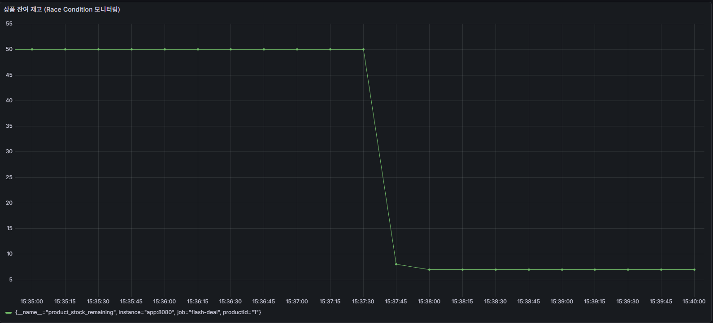
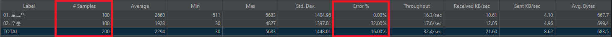

추가로 100건 중 **32건이 500 에러**로 실패했습니다. 서버 로그를 확인하니 아래 예외가 반복 발생하고 있었습니다.

```
Caused by: org.hibernate.exception.LockAcquisitionException: could not execute statement
  [Deadlock found when trying to get lock; try restarting transaction]
  [update products set category=?,description=?,image_url=?,is_deleted=?,name=?,
   price=?,status=?,stock_quantity=?,updated_at=? where product_id=?]
```

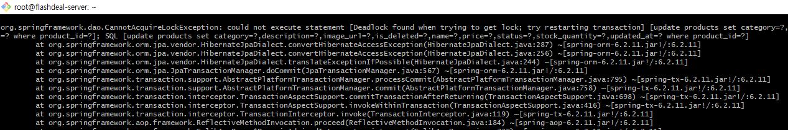

이는 과매도와 함께 **락 미적용이 낳은 또 다른 증상**입니다.

**🔍 원인 분석 — Lost Update + MySQL 데드락**

```java
// 락 없는 상태 — 일반 SELECT 후 엔티티에서 재고 감소
Product product = productService.findCartableProduct(productId); // 락 없는 SELECT
product.decreaseStock(quantity); // 메모리 값 기준으로 차감 후 UPDATE
```

```
초기 재고: 50개, 동시 요청: 100건

Thread  1: SELECT stock = 50 ┐
Thread  2: SELECT stock = 50 │ 모든 스레드가 동시에
Thread  3: SELECT stock = 50 │ 같은 값(50)을 읽음
   ...                        │
Thread 68: SELECT stock = 50 ┘

Thread  1: UPDATE stock = 49  ┐
Thread  2: UPDATE stock = 49  │ 각자 50-1=49를 계산해
Thread  3: UPDATE stock = 49  │ 서로의 변경을 덮어씀 (Lost Update)
   ...                        │
Thread 68: UPDATE stock = 49  ┘

결과: 주문 68건 성공, 재고 7개 → 25건 과매도
```

`decreaseStock()`에 `stock < quantity` 가드가 있어 음수는 발생하지 않습니다.
진짜 문제는 **여러 트랜잭션이 서로의 업데이트를 덮어써 재고가 제대로 줄지 않는 것**입니다.

**🔍 원인 분석 — MySQL 데드락 (500 에러)**

`order_items`가 `products`에 FK를 가지므로, INSERT 시 MySQL이 부모 행(`products`)에 **공유 락(S-Lock)** 을 획득합니다.
동시에 `UPDATE products SET stock_quantity = ?`는 동일 행에 **배타 락(X-Lock)** 을 요구합니다.
두 트랜잭션이 서로의 S-Lock을 기다리며 X-Lock을 획득하지 못하는 순환 대기가 발생합니다.

```
TX-A: order_items INSERT → products 행에 S-Lock 획득
TX-B: order_items INSERT → products 행에 S-Lock 획득

TX-A: products UPDATE → X-Lock 필요, TX-B의 S-Lock 대기 중
TX-B: products UPDATE → X-Lock 필요, TX-A의 S-Lock 대기 중

→ Deadlock! MySQL이 한 쪽을 Victim으로 롤백
```

`LockAcquisitionException`은 `CustomException`을 상속하지 않아 `GlobalExceptionHandler`의 `@ExceptionHandler(Exception.class)`에 걸려 **500**으로 응답됩니다.
비관적 락(`SELECT FOR UPDATE`)을 적용하면 한 트랜잭션이 X-Lock을 선점하여 다른 트랜잭션이 대기하므로, 이 순환 대기 자체가 발생하지 않습니다.

**⚖️ 해결 방법 비교**

| 방법 | 동작 방식 | 장점 | 단점 |
|------|----------|------|------|
| **낙관적 락** (`@Version`) | 커밋 시 버전 충돌 감지 → 예외 | DB 락 없음, 충돌 없을 때 성능 우수 | 고경합 시 `OptimisticLockException` 폭증 → 재시도 폭풍, 실패율 급등 |
| **비관적 락** (`SELECT FOR UPDATE`) | 조회 시점에 행 락 점유 → 직렬화 | 정합성 확실, 구현 단순 | 처리량 한계, 락 대기로 응답 지연 |
| **Redis 분산 락** (Redisson) | Redis 기반 외부 락 | DB 독립적, 분산 환경에 유리 | 단일 서버에서 공유 메모리 사용 가능한데 Redis 인프라까지 추가하는 건 오버엔지니어링 → 배제 |

**🧪 낙관적 락 적용 및 테스트**

`@Version` 필드만 추가하고 동일한 동시 주문 테스트(재고 50개, 100명 동시 요청)를 실행했습니다.

```java
// Product 엔티티 — 낙관적 락
@Version
private Long version;

// 커밋 시 Hibernate가 자동으로 아래 쿼리 실행
// UPDATE products SET stock_quantity=?, version=? WHERE product_id=? AND version=?
// → 다른 트랜잭션이 먼저 커밋했다면 version 불일치 → ObjectOptimisticLockingFailureException
```

서버 로그에는 아래 예외가 반복 발생했습니다.

```
Caused by: org.hibernate.exception.LockAcquisitionException: could not execute statement
  [Deadlock found when trying to get lock; try restarting transaction]
  [update products set ...,version=? where product_id=? and version=?]
```

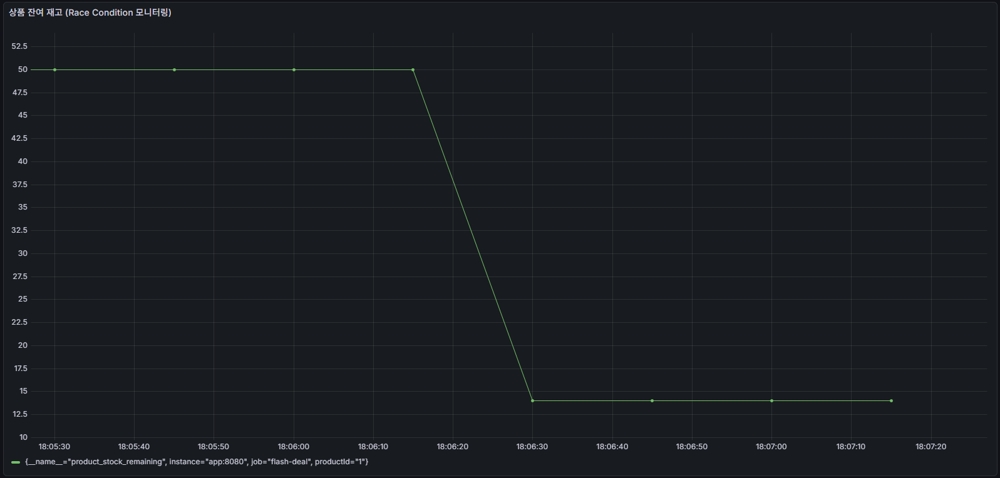
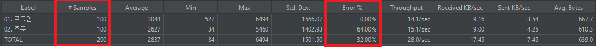

낙관적 락은 `UPDATE ... WHERE version=?` 조건으로 버전 충돌을 감지하지만, **데드락 자체를 막지는 못합니다.**
`order_items INSERT`의 FK S-Lock과 `products UPDATE`의 X-Lock이 여전히 순환 대기를 일으킵니다.
충돌이 발생할 때마다 예외가 throw되고, 재시도 로직 없이는 대부분 요청이 실패합니다.
재시도를 추가해도 고경합 환경에서는 재시도 요청이 연쇄 폭증해 오히려 서버 부하가 커집니다.
**동시 주문이 잦은 선착순 환경에서는 낙관적 락이 부적합**하다고 판단했습니다.

**✅ 채택 — 비관적 락 (Pessimistic Lock)**

낙관적 락의 실패를 직접 확인한 뒤, `SELECT ... FOR UPDATE`로 전환했습니다.

```java
// ProductRepository — SELECT FOR UPDATE 쿼리 추가
@Lock(LockModeType.PESSIMISTIC_WRITE)
@Query("SELECT p FROM Product p WHERE p.id = :productId")
Optional<Product> findByIdWithLock(@Param("productId") Long productId);

// ProductService.findCartableProduct() — SELECT FOR UPDATE로 변경
// 엔티티의 첫 번째 접근을 락 쿼리로 만들어 Hibernate 1차 캐시 stale 문제 방지
@Transactional
public Product findCartableProduct(Long productId) {
    Product product = productRepository.findByIdWithLock(productId)
            .orElseThrow(...);  // SELECT ... FOR UPDATE → 다른 트랜잭션 대기
    ...
    return product;
}

// OrderService.createDirectOrder() — 락이 걸린 엔티티에서 직접 재고 감소
Product product = productService.findCartableProduct(request.getProductId());
product.decreaseStock(request.getQuantity()); // 엔티티가 자신의 재고를 직접 관리
```

한 트랜잭션이 락을 점유하는 동안 다른 트랜잭션은 대기하므로, 항상 최신 재고를 기준으로 차감됩니다.
재고 50개에 100건 요청 시 정확히 50건만 성공하고, Grafana 게이지가 50 → 0으로 정확히 감소합니다.

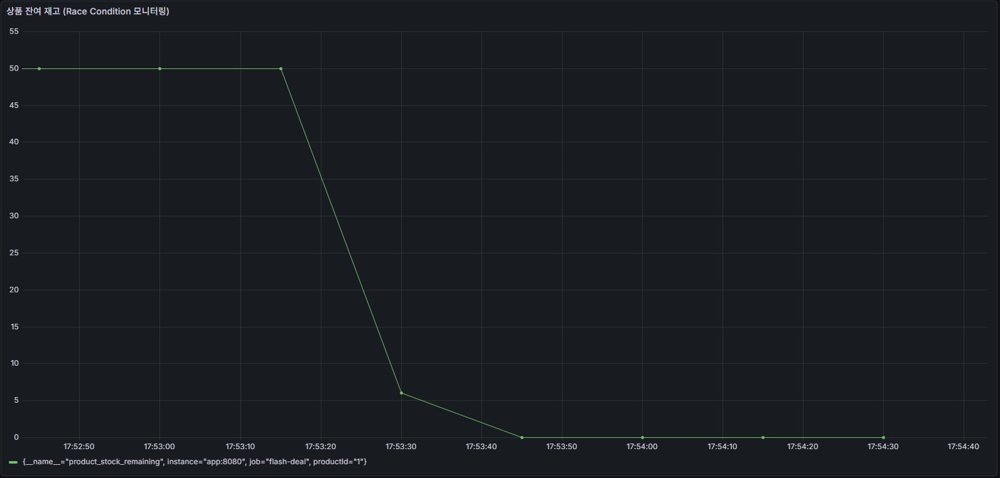
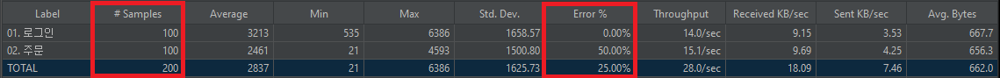

</details>

---

<details>
<summary><strong>🔴 "100명도 못 버티는 서버" — 부하테스트로 발견한 커넥션 풀 고갈</strong></summary>

<br>

**🚨 문제 발견**

기능 구현 완료 후 실제 서비스 수준의 트래픽을 감당할 수 있는지 검증하기 위해 JMeter 부하테스트를 진행했습니다.

**테스트 시나리오:** 로그인 → 상품 목록 조회 → 상품 상세 조회 → 바로 구매 (1유저 = 4요청)

| 설정 | 값 |
|------|-----|
| 동시 사용자 | 100명 |
| Ramp-up | 30초 |
| Duration | 120초 |

**Before 측정 결과**

| 지표 | 값 |
|------|-----|
| TPS | 72.8 req/sec |
| 평균 응답시간 | 1,196ms |
| P95 | 2,776ms |
| P99 | 3,630ms |
| 에러율 | 0% |

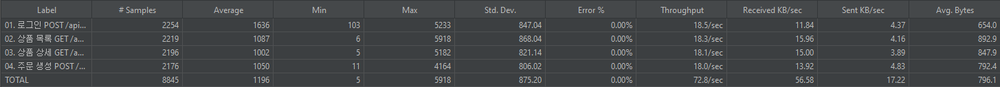
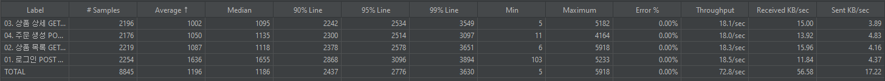

Grafana를 확인하니 **HikariCP Active 커넥션이 최대치(10)에 붙어 있고, Pending이 최대 90까지 치솟는 현상**을 발견했습니다.

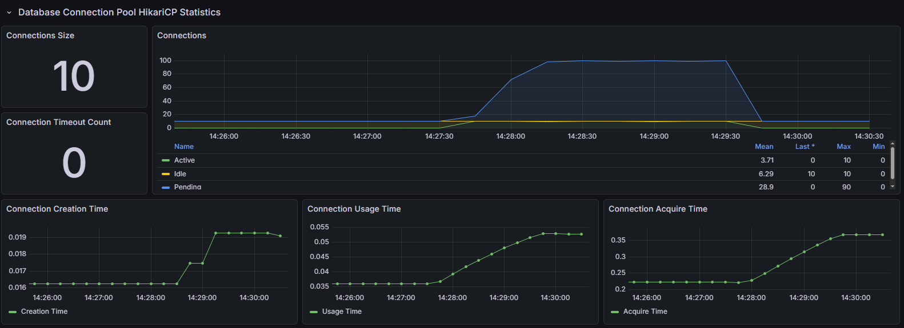
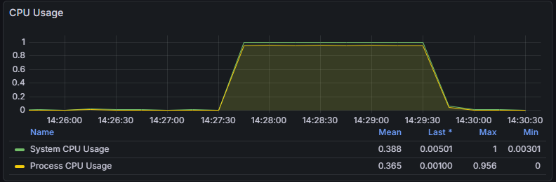

**🔍 원인 분석**

Little's Law에 따르면 최대 처리량 = 커넥션 수 / 평균 응답시간입니다.

```
Max TPS ≈ Pool Size(10) / Avg Response Time(1.2s) ≈ 8.3 req/sec
```

HikariCP 기본값 max-pool-size=10으로는 평균 응답시간 1.2초 기준 이론상 8~9 TPS가 한계입니다.
100명이 동시에 요청하면 커넥션을 기다리는 Pending 대기열이 폭발적으로 증가합니다.

**⚖️ 해결 방법 비교**

| 방법 | 장점 | 단점 |
|------|------|------|
| **Pool Size 증가** | 즉시 적용, 설정만으로 해결 | 커넥션은 메모리 소비, 무한정 늘릴 수 없음. DB 서버도 max_connections 제한 있음 |
| **응답시간 단축** | 근본적인 해결, Pool Size 효율 극대화 | 병목 원인 파악 후 추가 최적화 필요 |
| **두 가지 병행** | 즉각적 개선 + 근본 해결 | - |

**✅ 채택 — Pool Size 조정 + 응답시간 단축 병행**

```yaml
# application-prod.yml
spring:
  datasource:
    hikari:
      maximum-pool-size: ___   # TODO: After 수치 기입
      minimum-idle: ___
```

**After 측정 결과**

| 지표 | Before | After | 개선율 |
|------|--------|-------|-------|
| TPS | 72.8 | ___ | ___% |
| P95 | 2,776ms | ___ | ___% |
| P99 | 3,630ms | ___ | ___% |
| HikariCP Pending | 최대 90 | ___ | - |

</details>

---

## 📈 V1 부하 테스트 & 성능 최적화

> 싱글 서버(NCP vCPU 2EA, 8GB RAM)에서 선착순 딜 주문의 성능 한계를 단계적으로 탐색하고,
> 병목 원인을 데이터로 증명한 뒤, 최적화 적용 후 Before/After를 비교한 기록입니다.

### 테스트 환경

| 항목 | 스펙 |
|------|------|
| 서버 | NCP vCPU 2EA, RAM 8GB, Ubuntu |
| WAS | Spring Boot 3.5.6 (내장 Tomcat) |
| DB | MySQL 8.0 (같은 서버, Docker) |
| HikariCP | max-pool-size: 10 (기본값) |
| 세션 | In-Memory (서버 메모리) |
| 테스트 도구 | Apache JMeter 5.6.3 |
| 모니터링 | Grafana + Prometheus + Micrometer |

### 테스트 시나리오

실제 플래시 딜 사용 패턴을 재현했습니다.

```
1. 로그인 (Once Only Controller — 스레드당 1회)
2. 전원 로그인 완료 대기 (Synchronizing Timer)
3. 딜 목록 조회 GET /api/deals          ← 동시 출발
4. 딜 상세 조회 GET /api/deals/{id}
5. 딜 주문 POST /api/deals/{id}/order   ← 핵심 측정 구간
```

---

<details>
<summary><strong>Phase 1. Before — 병목이 있는 상태에서 단계별 부하 테스트 (10 → 1000명)</strong></summary>

<br>

**목적:** 최적화 전 V1 서버의 성능을 기록하고, 병목의 심각성을 데이터로 증명

#### 1-1. Smoke Test (10명)

| API | Avg (ms) | P95 (ms) | Max (ms) | Error % |
|-----|----------|----------|----------|---------|
| 로그인 | 529 | 560 | 561 | 0% |
| 딜 목록 조회 | 55 | 63 | 63 | 0% |
| 딜 상세 조회 | 47 | 52 | 52 | 0% |
| **딜 주문** | **817** | **908** | **1,045** | **30%** |

| 항목 | 값 |
|------|-----|
| 재고 차감 | 10개 중 **1개만 감소** |
| 초과 판매 | **9건** |

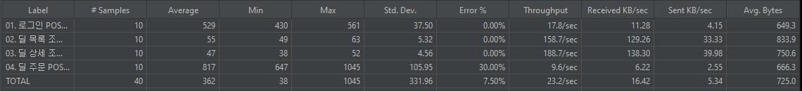
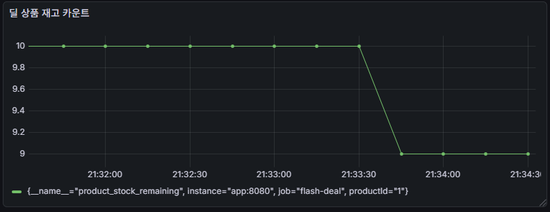
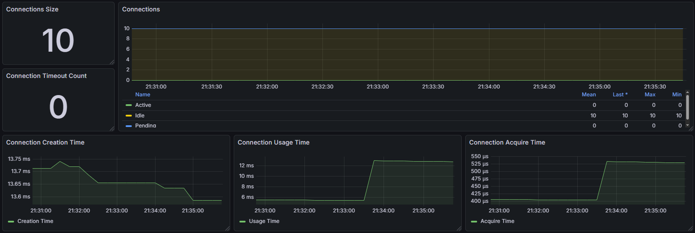

> 10명만으로도 Race Condition 발생. 주문 10건 성공했지만 재고는 1개만 감소.

---

#### 1-2. Load Test (100명)

| API | Avg (ms) | P95 (ms) | Max (ms) | Error % |
|-----|----------|----------|----------|---------|
| 로그인 | 2,884 | 4,754 | 5,167 | 0% |
| 딜 목록 조회 | 181 | 306 | 313 | 0% |
| 딜 상세 조회 | 166 | 257 | 269 | 0% |
| **딜 주문** | **4,204** | **7,018** | **7,993** | **17%** |

| 항목 | 값 |
|------|-----|
| 재고 차감 | 100개 중 **11개만 감소** |
| 초과 판매 | **약 72건** |
| HikariCP Pending 최대 | **3** |
| Connection Acquire Time | **250ms** |

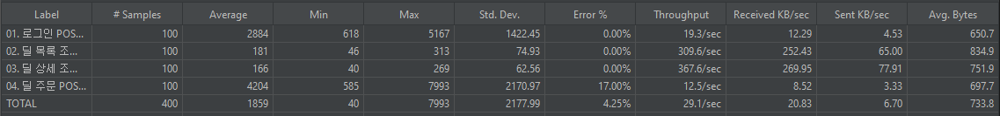
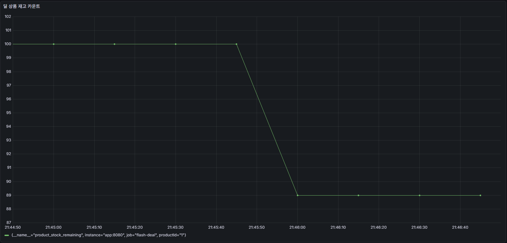
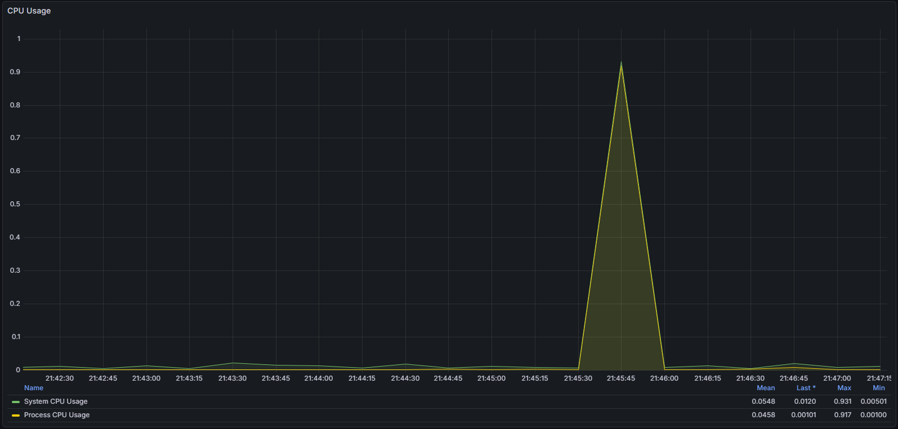
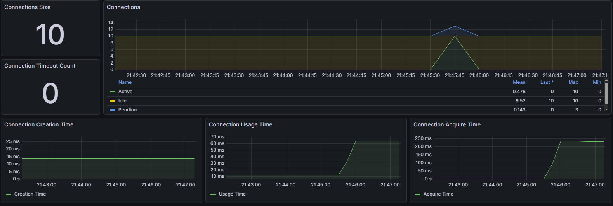

> Connection Pool 포화 징후 시작. Active 10개(풀 100%) 도달, Pending 발생.

---

#### 1-3. Load Test (300명)

| API | Avg (ms) | P95 (ms) | Max (ms) | Error % |
|-----|----------|----------|----------|---------|
| 로그인 | 7,866 | 13,620 | 14,853 | 0% |
| 딜 목록 조회 | 432 | 708 | 744 | 0% |
| 딜 상세 조회 | 370 | 569 | 603 | 0% |
| **딜 주문** | **11,879** | **20,931** | **23,271** | **21.33%** |

| 항목 | 값 |
|------|-----|
| 재고 차감 | 500개 중 **31개만 감소** |
| 초과 판매 | **약 205건** |
| HikariCP Pending 최대 | **30** |
| 모니터링 공백 | **약 40초** (서버 과부하로 Prometheus 응답 불가) |

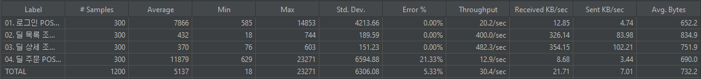
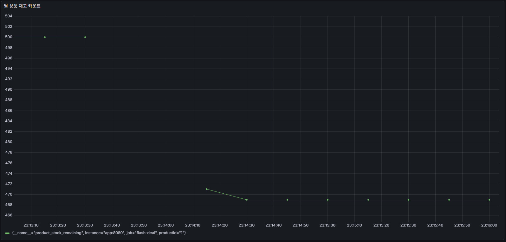
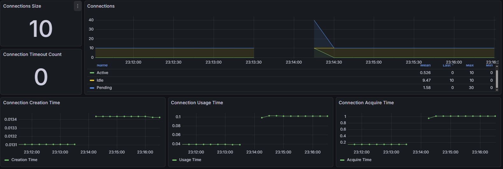

> 재고 그래프에 40초간 데이터 공백 — 서버가 모니터링 요청조차 처리 못하는 상태.

---

#### 1-4. Load Test (500명)

| API | Avg (ms) | P95 (ms) | Max (ms) | Error % |
|-----|----------|----------|----------|---------|
| 로그인 | 12,651 | 22,199 | 24,356 | 0% |
| 딜 목록 조회 | 550 | 912 | 954 | 0% |
| 딜 상세 조회 | 377 | 654 | 725 | 0% |
| **딜 주문** | **19,101** | **34,084** | **37,944** | **20.80%** |

| 항목 | 값 |
|------|-----|
| 재고 차감 | 500개 중 **50개만 감소** |
| 초과 판매 | **약 346건** |
| HikariCP Pending 최대 | **164** |
| Connection Acquire Time | **2.2초** |
| 모니터링 공백 | **약 70초** |

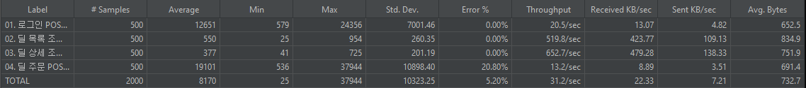
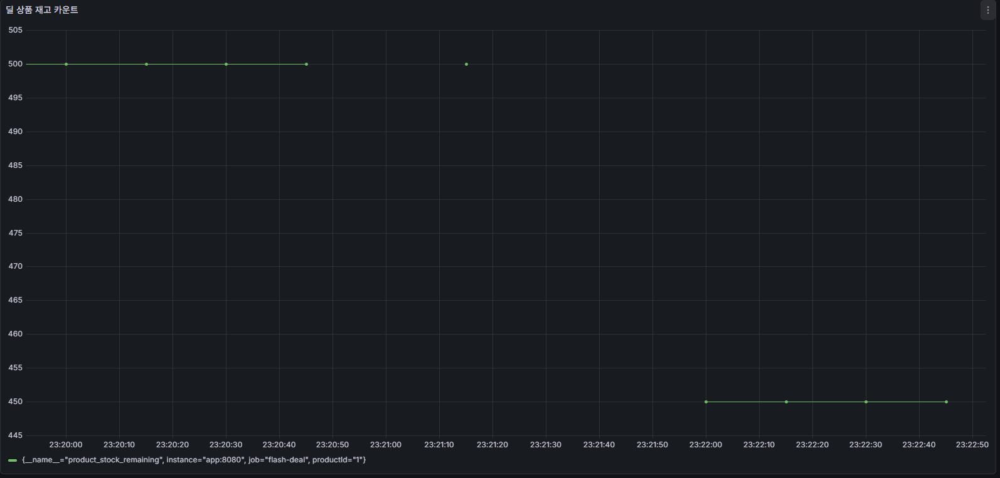
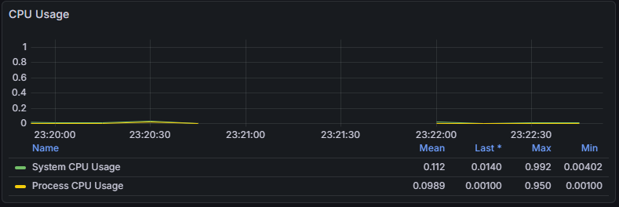
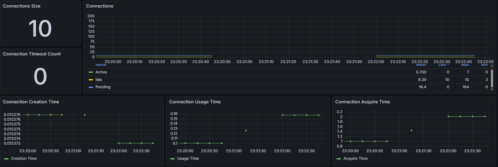

> Pending 164개 — 커넥션 풀 완전 붕괴. CPU Max 99.2%.

---

#### 1-5. Load Test (1000명)

| API | Avg (ms) | P95 (ms) | Max (ms) | Error % |
|-----|----------|----------|----------|---------|
| 로그인 | 24,589 | 43,579 | 48,076 | 0.10% |
| 딜 목록 조회 | 766 | 1,362 | 1,478 | 0% |
| 딜 상세 조회 | 711 | 1,271 | 1,448 | 0% |
| **딜 주문** | **38,389** | **68,667** | **76,448** | **20.30%** |

| 항목 | 값 |
|------|-----|
| 재고 차감 | 1000개 중 **약 98개만 감소** |
| 초과 판매 | **약 700건** |
| Connection Timeout | **1회 발생** |
| 모니터링 공백 | **약 2분** |

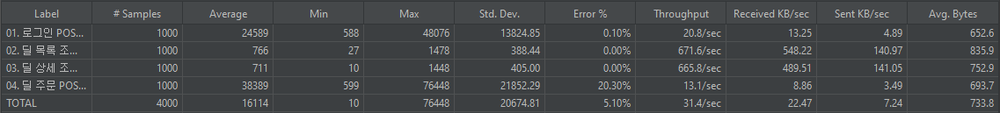
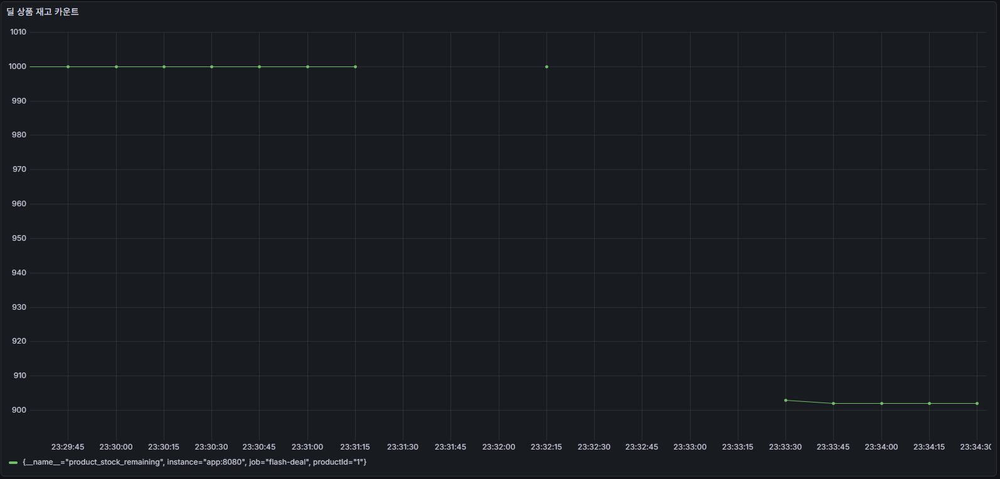
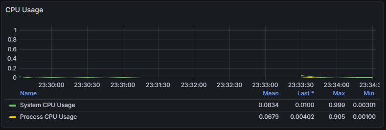
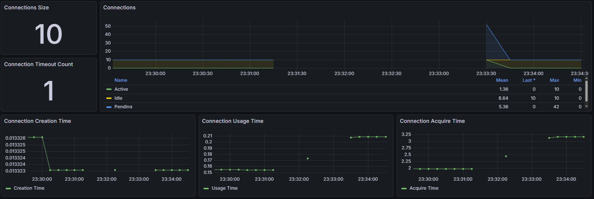

> 딜 주문 최대 응답시간 **76초**. Connection Timeout 최초 발생. 사실상 서비스 불가 상태.

---

#### Before 종합

| 동시 사용자 | 딜 주문 Avg | 딜 주문 Error | 재고 차감 | 초과 판매 | Pending Max |
|-----------|-----------|-------------|---------|---------|------------|
| 10명 | 817ms | 30% | 1개 | 9건 | 0 |
| 100명 | 4,204ms | 17% | 11개 | ~72건 | 3 |
| 300명 | 11,879ms | 21.33% | 31개 | ~205건 | 30 |
| 500명 | 19,101ms | 20.80% | 50개 | ~346건 | 164 |
| 1000명 | 38,389ms | 20.30% | ~98개 | ~700건 | 42 |

</details>

---

<details>
<summary><strong>Phase 2. 병목 분석 — 왜 성능이 저하되는가?</strong></summary>

<br>

Phase 1 결과에서 **10명부터 이미 데이터 정합성이 깨지고**, 100명부터 Connection Pool 고갈이 시작되었습니다.

#### 병목 1: Race Condition (재고 정합성 깨짐)

**증상:** 1000명 주문 → 재고 약 98개만 감소 → **약 700건 초과 판매**

**원인:** `StockService.decreaseStock()`이 lock 없는 `findByProductId()`를 사용

```java
// lock 없는 조회 — 여러 트랜잭션이 같은 재고를 읽음
Stock stock = stockRepository.findByProductId(productId)
    .orElseThrow(...);
stock.decrease(quantity);  // 각자 같은 값에서 차감 → Lost Update
```

```
Thread 1: SELECT quantity = 100  ┐
Thread 2: SELECT quantity = 100  │ 동시에 같은 값을 읽음
Thread 3: SELECT quantity = 100  ┘
Thread 1: UPDATE quantity = 99   ┐
Thread 2: UPDATE quantity = 99   │ 서로의 변경을 덮어씀
Thread 3: UPDATE quantity = 99   ┘
결과: 3건 주문 성공, 재고는 1만 감소
```

#### 병목 2: Connection Pool 고갈 (@Transactional 안에서 결제)

**증상:** HikariCP Pending 최대 164, Connection Timeout 발생, 모니터링 공백 2분

**원인:** `FakePaymentClient.pay()` (500~1000ms 지연)가 `@Transactional` 안에서 실행

```java
@Transactional  // 트랜잭션 시작 → DB 커넥션 획득
public OrderResponse createDealOrder(...) {
    stockService.decreaseStock(...);           // 재고 차감
    fakePaymentClient.pay(memberId, amount);   // 500~1000ms 대기 (커넥션 점유 중!)
    order.completePayment(...);                // 결제 완료 처리
}  // 트랜잭션 종료 → 커넥션 반환 (여기까지 최소 500ms 이상 점유)
```

**Little's Law 분석:**
```
최대 TPS = Pool Size / 평균 커넥션 점유 시간
         = 10 / 0.75s
         ≈ 13.3 TPS

→ 이론상 초당 13건이 한계. 그 이상은 전부 Pending 대기열에 쌓임.
```

</details>

---

<details>
<summary><strong>Phase 3. 최적화 적용 — 비관적 락 + 트랜잭션 분리</strong></summary>

<br>

Phase 2에서 데이터로 증명한 2가지 병목만 해결합니다.

#### 최적화 1: 비관적 락 적용 (Race Condition 해결)

```java
// Before: lock 없는 조회
Stock stock = stockRepository.findByProductId(productId);

// After: SELECT FOR UPDATE — 한 트랜잭션씩 순차 처리
Stock stock = stockRepository.findByProductIdWithLock(productId);
```

#### 최적화 2: 트랜잭션 분리 (Connection Pool 고갈 해결)

Spring 프록시의 내부 호출 한계를 해결하기 위해 `DealOrderTransactionService`를 별도 빈으로 분리했습니다.

```java
// Before: 하나의 @Transactional에서 결제까지 실행
@Transactional
public OrderResponse createDealOrder(...) {
    stockService.decreaseStock(...);
    fakePaymentClient.pay(...);      // 500~1000ms 커넥션 점유
    order.completePayment(...);
}

// After: 트랜잭션 3단계 분리
public OrderResponse createDealOrder(...) {
    // TX1: 검증 + 재고 차감 → 커넥션 즉시 반환
    DealOrderContext ctx = dealOrderTxService.validateAndDecreaseStock(...);

    // 결제: 트랜잭션 밖 → DB 커넥션 미점유
    fakePaymentClient.pay(...);

    // TX2: 주문 생성 + 결제 완료
    return dealOrderTxService.completeOrder(ctx, request);
}
```

</details>

---

<details>
<summary><strong>Phase 4. After — 최적화 후 동일 테스트 재실행</strong></summary>

<br>

**목적:** 같은 조건에서 테스트를 재실행하여 최적화 효과를 정량적으로 비교

#### 4-1. Smoke Test After (10명)

| API | Avg (ms) | P95 (ms) | Max (ms) | Error % |
|-----|----------|----------|----------|---------|
| 로그인 | 554 | 570 | 571 | 0% |
| 딜 목록 조회 | 89 | 94 | 94 | 0% |
| 딜 상세 조회 | 72 | 77 | 79 | 0% |
| **딜 주문** | **969** | **1,116** | **1,187** | **0%** |

| 항목 | Before | After |
|------|--------|-------|
| 재고 차감 | 1개 (9건 초과판매) | **10개 (정확)** |
| 에러율 | 30% | **0%** |
| HikariCP Pending | 0 | **0** |

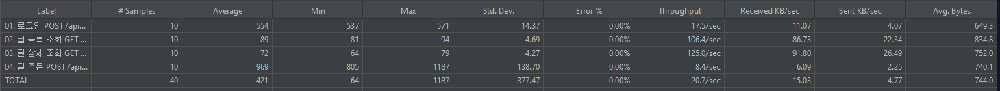
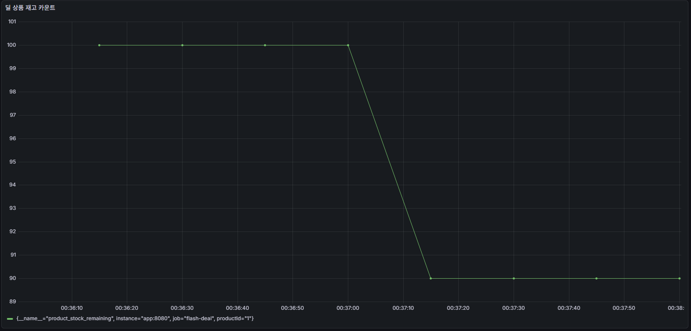
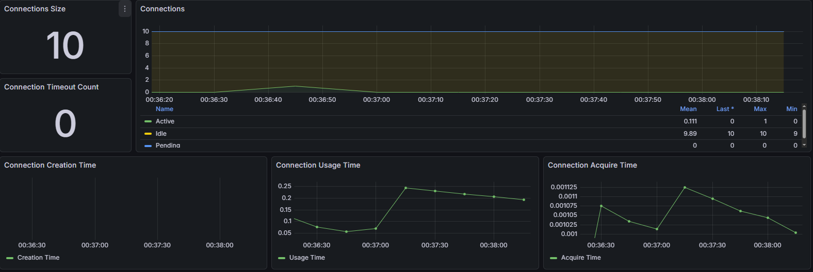

---

#### 4-2. Load Test After (100명)

| API | Avg (ms) | P95 (ms) | Max (ms) | Error % |
|-----|----------|----------|----------|---------|
| 로그인 | 3,033 | 5,180 | 5,478 | 0% |
| 딜 목록 조회 | 191 | 296 | 309 | 0% |
| 딜 상세 조회 | 123 | 194 | 210 | 0% |
| **딜 주문** | **4,255** | **7,367** | **8,122** | **0%** |

| 항목 | Before | After |
|------|--------|-------|
| 재고 차감 | 11개 (72건 초과판매) | **100개 (정확)** |
| 에러율 | 17% | **0%** |
| HikariCP Pending Max | 3 | **16** |
| Connection Acquire Time | 250ms | **50ms** |

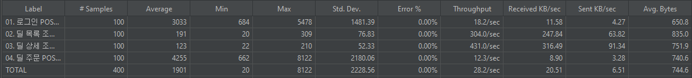
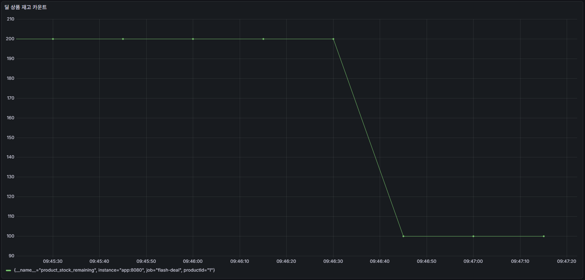
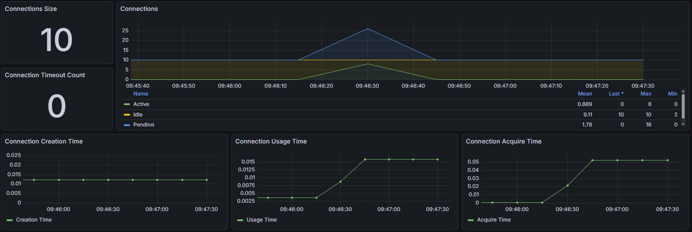

---

#### 4-3. Load Test After (300명)

| API | Avg (ms) | P95 (ms) | Max (ms) | Error % |
|-----|----------|----------|----------|---------|
| 로그인 | 8,075 | 14,757 | 15,303 | 0% |
| 딜 목록 조회 | 389 | 611 | 626 | 0% |
| 딜 상세 조회 | 231 | 383 | 433 | 0% |
| **딜 주문** | **11,865** | **21,000** | **23,185** | **0%** |

| 항목 | Before | After |
|------|--------|-------|
| 재고 차감 | 31개 (205건 초과판매) | **300개 (정확)** |
| 에러율 | 21.33% | **0%** |
| HikariCP Pending Max | 30 | **0** |
| 모니터링 공백 | 40초 | **없음** |

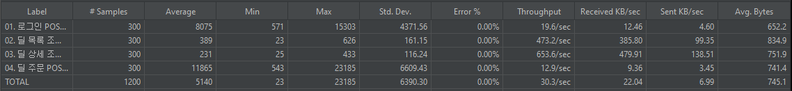
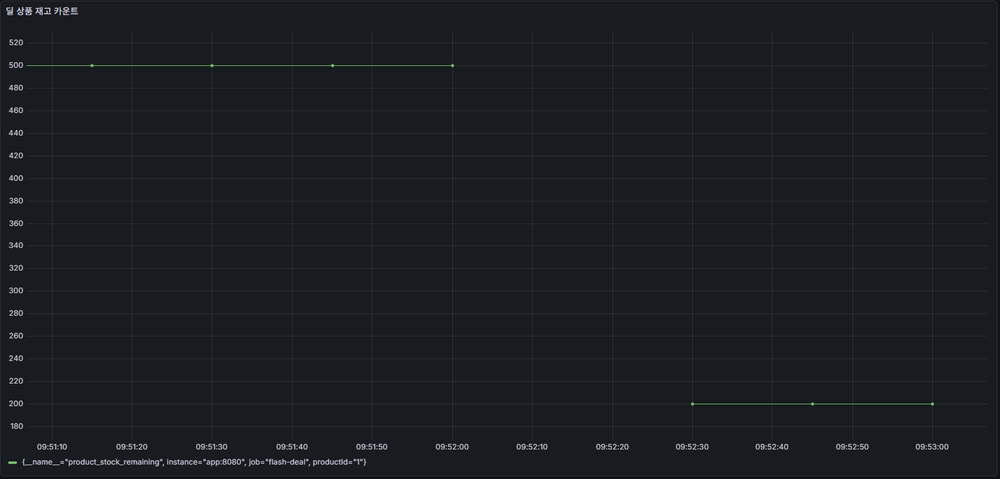
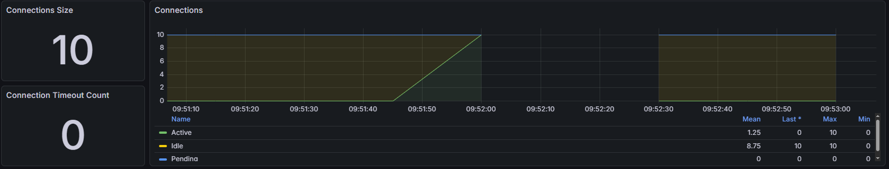

---

#### 4-4. Load Test After (500명)

| API | Avg (ms) | P95 (ms) | Max (ms) | Error % |
|-----|----------|----------|----------|---------|
| 로그인 | 12,764 | 22,409 | 24,643 | 0% |
| 딜 목록 조회 | 604 | 929 | 1,034 | 0% |
| 딜 상세 조회 | 186 | 392 | 558 | 0% |
| **딜 주문** | **19,387** | **34,666** | **38,533** | **0%** |

| 항목 | Before | After |
|------|--------|-------|
| 재고 차감 | 50개 (346건 초과판매) | **500개 (정확)** |
| 에러율 | 20.80% | **0%** |
| HikariCP Pending Max | 164 | **4** |
| CPU Max | 99.2% | **56.3%** |
| 모니터링 공백 | 70초 | **없음** |

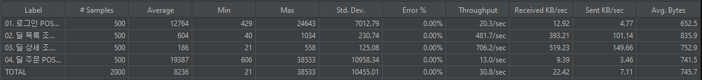

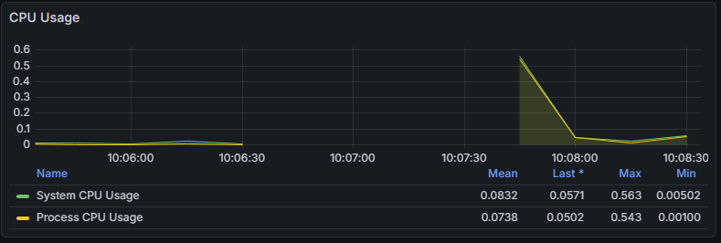


---

#### 4-5. Load Test After (1000명)

| API | Avg (ms) | P95 (ms) | Max (ms) | Error % |
|-----|----------|----------|----------|---------|
| 로그인 | 24,228 | 43,353 | 47,848 | 0.50% |
| 딜 목록 조회 | 1,061 | 1,650 | 1,775 | 0% |
| 딜 상세 조회 | 647 | 1,078 | 1,223 | 0% |
| **딜 주문** | **38,061** | **68,180** | **76,065** | **0.50%** |

| 항목 | Before | After |
|------|--------|-------|
| 재고 차감 | ~98개 (700건 초과판매) | **~1000개 (정확)** |
| 에러율 | 20.30% | **0.50%** |
| Connection Timeout | 1 | **5** |
| 모니터링 공백 | ~2분 | **~2분 (동일)** |

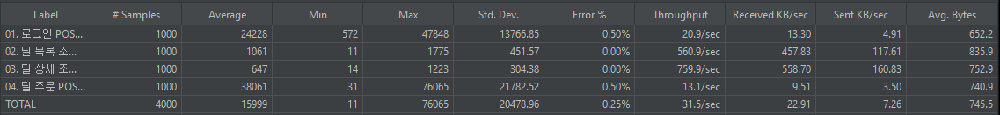
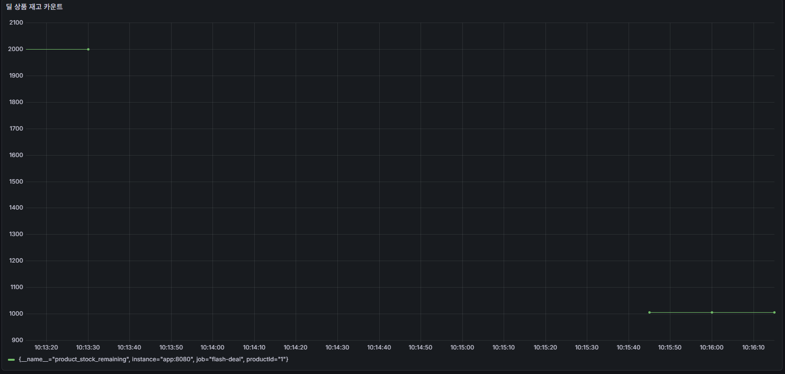
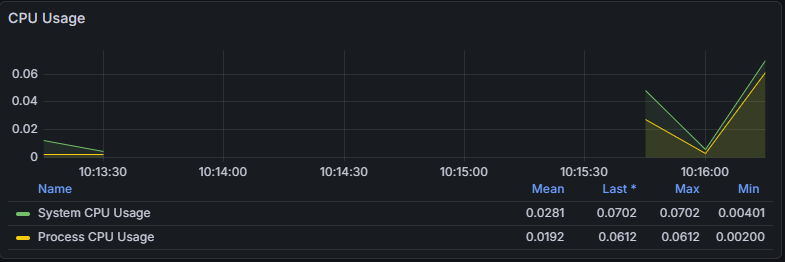
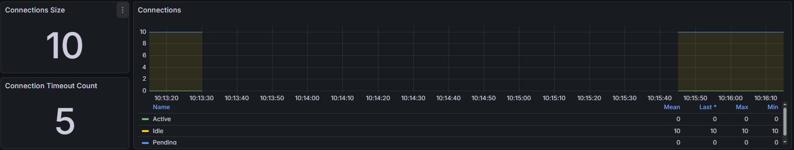

> 1000명에서는 데이터 정합성은 해결되었으나, 비관적 락의 순차 처리로 인해 응답시간과 모니터링 공백은 개선되지 않음.

</details>

---

<details>
<summary><strong>Phase 5. 결론 — Before/After 종합 비교 및 V2 스케일아웃 근거</strong></summary>

<br>

#### 재고 정합성 (초과 판매)

| 동시 사용자 | Before 초과 판매 | After 초과 판매 |
|-----------|---------------|---------------|
| 10명 | 9건 | **0건** |
| 100명 | ~72건 | **0건** |
| 300명 | ~205건 | **0건** |
| 500명 | ~346건 | **0건** |
| 1000명 | ~700건 | **0건** |

#### 에러율

| 동시 사용자 | Before | After |
|-----------|--------|-------|
| 10명 | 30% | **0%** |
| 100명 | 17% | **0%** |
| 300명 | 21.33% | **0%** |
| 500명 | 20.80% | **0%** |
| 1000명 | 20.30% | **0.50%** |

#### HikariCP Pending (커넥션 대기)

| 동시 사용자 | Before | After |
|-----------|--------|-------|
| 10명 | 0 | **0** |
| 100명 | 3 | **16** |
| 300명 | 30 | **0** |
| 500명 | 164 | **4** |
| 1000명 | 42 | **0** |

#### 최적화로 해결된 것

| 병목 | 해결 방법 | 효과 |
|------|---------|------|
| Race Condition | 비관적 락 (SELECT FOR UPDATE) | 초과 판매 0건 — **데이터 정합성 100% 보장** |
| Connection Pool 고갈 | 트랜잭션 분리 (결제를 TX 밖으로) | 500명 기준 Pending 164 → 4 **(97% 감소)** |

#### 최적화 후에도 남는 한계 (1000명)

| 한계 | 수치 | 원인 |
|------|------|------|
| 딜 주문 평균 응답시간 | **38초** | 비관적 락이 1000건을 순차 처리 |
| Connection Timeout | **5회** | 순차 처리로 인한 대기 시간 누적 |
| 모니터링 공백 | **약 2분** | 서버 자원 한계 |

비관적 락으로 **데이터 정합성은 완전히 해결**했지만, **처리 성능(응답시간, TPS)은 단일 서버 + 단일 DB의 물리적 한계**입니다. 이 한계를 극복하려면 아키텍처 레벨의 변경이 필요합니다.

#### 다음 단계 — 스케일아웃 전에, 단일 서버를 먼저 최적화한다

비관적 락 + 트랜잭션 분리로 **데이터 정합성과 커넥션 풀 고갈**은 해결했지만, 1000명 기준 딜 주문 평균 응답시간 38초는 여전히 서비스 불가 수준입니다.

여기서 바로 서버를 늘리는 것은 **"느린 서버를 3대 띄우는 것"** 에 불과합니다.
단일 서버에서 할 수 있는 최적화를 모두 시도하고, 그래도 한계가 올 때 비로소 스케일아웃의 근거가 됩니다.

> **V1-b** (현재) → **V1-c** (단일 서버 최적화) → **V1-d** (최적화 후 한계 증명) → **V2** (스케일아웃)

</details>

---

<details>
<summary><strong>Phase 6. V1-c 계획 — 단일 서버 최적화 (스케일아웃 전 필수 단계)</strong></summary>

<br>

> 서버를 늘리기 전에, 한 대의 서버에서 뽑아낼 수 있는 최대 성능을 먼저 확인한다.

#### 테스트 전략 — 단일 API 테스트 vs 시나리오 테스트

| | 단일 API 테스트 | 시나리오 테스트 |
|--|----------------|---------------|
| **방식** | 하나의 API만 집중 호출 | 실제 사용 흐름대로 여러 API 순차 호출 |
| **목적** | 특정 최적화의 **효과를 격리**해서 측정 | 전체 서비스가 **트래픽을 버티는지** 종합 측정 |
| **언제** | 최적화 항목 적용 직후 Before/After 비교 | 모든 최적화 완료 후 최종 검증 |

**원칙:** 최적화 항목별로 **단일 API 테스트**로 효과를 격리 측정하고, 전체 최적화 완료 후 **시나리오 테스트**로 종합 검증한다.

---

#### Step 1. Baseline — 최적화 전 단일 API 성능 측정

**목적:** 각 API의 개별 성능을 기록해두어, 이후 최적화마다 정확한 Before/After 비교 기준을 확보

**테스트 방식:** 단일 API 테스트 (API별 독립 측정)

| 테스트 | API | 동시 사용자 | Duration | 측정 항목 |
|--------|-----|-----------|----------|----------|
| Baseline-1 | `GET /api/deals` | 500명 | 60초 | Avg, P95, P99, TPS |
| Baseline-2 | `GET /api/deals/{id}` | 500명 | 60초 | Avg, P95, P99, TPS |
| Baseline-3 | `POST /api/deals/{id}/order` | 500명 | 60초 | Avg, P95, P99, TPS, 에러율 |

> 시나리오 테스트 Baseline은 Phase 4 결과(500명: 19s avg)를 그대로 사용한다.

---

#### Step 2. Slow Query 분석 + 인덱싱

**목적:** DB 레벨 병목을 가장 먼저 제거한다. 인덱스 하나가 응답시간을 수십 배 단축할 수 있다.

**작업 내용:**

```
1. MySQL Slow Query Log 활성화 (long_query_time: 1s)
2. Step 1의 Baseline 테스트를 재실행하며 Slow Query 수집
3. EXPLAIN ANALYZE로 실행 계획 분석
4. 필요한 인덱스 추가 (WHERE, JOIN, ORDER BY 대상 컬럼)
```

**예상 인덱싱 대상:**

| 쿼리 | 예상 병목 | 해결 |
|------|----------|------|
| `SELECT ... FROM stocks WHERE product_id = ?` | product_id 인덱스 확인 | 인덱스 추가/검토 |
| `SELECT ... FROM deals WHERE status = ? AND ...` | 시간 범위 풀 스캔 | 복합 인덱스 (status, start_at, end_at) |
| `SELECT ... FROM deal_orders WHERE member_id = ?` | member_id 풀 스캔 | 인덱스 추가 |

**검증 테스트:** 단일 API 테스트

| 테스트 | API | 비교 대상 |
|--------|-----|----------|
| Index-1 | `GET /api/deals` | Baseline-1과 비교 |
| Index-2 | `GET /api/deals/{id}` | Baseline-2와 비교 |
| Index-3 | `POST /api/deals/{id}/order` | Baseline-3과 비교 |

> 인덱싱만으로 얼마나 개선되는지 격리 측정. 다른 변수는 건드리지 않는다.

---

#### Step 3. HikariCP 커넥션 풀 튜닝

**목적:** 트랜잭션 분리 후에도 남아있는 커넥션 대기(Pending)를 최소화

**작업 내용:**

```
1. maximum-pool-size 조정 (기본값 10 → 서버 스펙 기반 산정)
2. minimum-idle 설정으로 유휴 커넥션 유지
3. connection-timeout, max-lifetime 최적화
```

**산정 기준:**
```
Pool Size = (core_count * 2) + effective_spindle_count
         = (2 * 2) + 1
         = 5 (최소) ~ 20 (여유)
```

> HikariCP 공식 권장: 적은 커넥션으로도 높은 처리량 가능. 무조건 늘리면 오히려 컨텍스트 스위칭 비용 증가.

**검증 테스트:** 단일 API 테스트 — **주문 API만 테스트**

| 테스트 | API | 왜 이 API만? |
|--------|-----|-------------|
| Pool-1 | `POST /api/deals/{id}/order` | 커넥션을 가장 오래 점유하는 API. 조회 API는 커넥션 점유 시간이 짧아 풀 튜닝 효과가 미미 |

**측정 지표:** HikariCP Active/Pending/Idle, Connection Acquire Time, 주문 응답시간

---

#### Step 4. Tomcat 스레드 풀 튜닝

**목적:** 동시 요청 처리 능력을 서버 자원에 맞게 최적화

**작업 내용:**

```
1. server.tomcat.threads.max 조정 (기본값 200)
2. server.tomcat.threads.min-spare 조정 (기본값 10)
3. server.tomcat.accept-count 조정 (대기 큐 크기)
4. 스레드 수와 커넥션 풀 크기의 균형점 탐색
```

**주의:** vCPU 2EA 환경에서 스레드를 무한정 늘리면 컨텍스트 스위칭 + 메모리 오버헤드로 오히려 성능 저하.

**검증 테스트:** 단일 API 테스트 — **주문 API로 여러 스레드 설정 비교**

| 테스트 | threads.max | 비교 |
|--------|------------|------|
| Thread-A | 100 | 기본(200) 대비 |
| Thread-B | 200 (기본) | 기준 |
| Thread-C | 50 | 기본(200) 대비 |

> 같은 부하에서 스레드 수만 바꿔가며 **최적 설정을 탐색**한다.

**측정 지표:** JVM Threads (Live/Peak), CPU Usage, 응답시간, TPS

---

#### Step 5. 로컬 캐싱 (Caffeine Cache)

**목적:** 반복 조회되는 데이터를 캐싱하여 DB 부하를 줄인다

**캐싱 대상:**

| API | 캐싱 이유 | TTL |
|-----|----------|-----|
| `GET /api/deals` | 모든 유저가 동일한 목록 조회, 변경 빈도 낮음 | 5~10초 |
| `GET /api/deals/{id}` | 동일 딜을 수백 명이 동시 조회 | 3~5초 |

**왜 Redis가 아닌 Caffeine인가?**
- 단일 서버 환경에서는 **JVM 내 로컬 캐시가 네트워크 비용 없이 가장 빠름**
- Redis는 다중 서버 간 캐시 일관성이 필요할 때 도입 (V2에서 검토)

**주의:** 재고 수량은 캐싱하지 않음 (실시간 정합성 필요)

**검증 테스트:** 단일 API 테스트 — **조회 API만 테스트**

| 테스트 | API | 왜 이 API만? |
|--------|-----|-------------|
| Cache-1 | `GET /api/deals` | 캐시 적용 대상 |
| Cache-2 | `GET /api/deals/{id}` | 캐시 적용 대상 |

> 주문 API는 캐싱 대상이 아니므로 테스트하지 않는다.

**측정 지표:** Cache Hit Rate, DB 쿼리 수, 딜 조회 응답시간, TPS

---

#### Step 6. 종합 검증 — 시나리오 테스트

**목적:** Step 2~5의 모든 최적화를 적용한 상태에서, Phase 1~4와 동일한 시나리오 테스트를 실행하여 **전체 서비스 성능을 종합 비교**

**테스트 방식:** 시나리오 테스트 (Phase 1~4와 동일한 흐름)

```
1. 로그인 (Once Only Controller)
2. 전원 로그인 완료 대기 (Synchronizing Timer)
3. 딜 목록 조회 GET /api/deals
4. 딜 상세 조회 GET /api/deals/{id}
5. 딜 주문 POST /api/deals/{id}/order
```

| 동시 사용자 | 비교 대상 (Phase 4 After) |
|-----------|------------------------|
| 100명 | Avg 4,255ms, P95 7,367ms, Error 0% |
| 300명 | Avg 11,865ms, P95 21,000ms, Error 0% |
| 500명 | Avg 19,387ms, P95 34,666ms, Error 0% |
| 1000명 | Avg 38,061ms, P95 68,180ms, Error 0.50% |

> 단일 API 테스트에서는 각각 빨라졌어도, **로그인 + 조회 + 주문이 동시에 걸리면** 다른 결과가 나올 수 있다. 그래서 시나리오 테스트로 최종 검증한다.

---

#### 전체 흐름 요약

```
Step 1. Baseline (단일 API)     → 각 API의 개별 성능 기록
  ↓
Step 2. 인덱싱 (단일 API)       → 인덱싱 효과만 격리 측정
  ↓
Step 3. 커넥션 풀 (단일 API)    → 주문 API에서 풀 튜닝 효과 측정
  ↓
Step 4. 스레드 풀 (단일 API)    → 여러 설정 비교하여 최적값 탐색
  ↓
Step 5. 캐싱 (단일 API)         → 조회 API에서 캐싱 효과 측정
  ↓
Step 6. 종합 검증 (시나리오)     → 모든 최적화 적용 후 전체 성능 비교
```

</details>

---

<details>
<summary><strong>Phase 7. V1-d 계획 — 최적화 후 한계 증명 (스케일아웃 근거 확보)</strong></summary>

<br>

> Phase 6 종합 검증에서 성능 개선을 확인한 뒤, 부하를 더 올려서 단일 서버의 한계점을 찾는다.

#### 목적

- 최적화된 단일 서버의 **새로운 성능 천장** 측정
- "여기까지가 한 대의 한계"를 **데이터로 증명**
- "왜 서버를 늘려야 하는가?"에 대한 **정량적 근거 확보**

#### 테스트 방식 — 시나리오 테스트 (한계까지 부하 증가)

| 동시 사용자 | 목적 |
|-----------|------|
| 1000명 | Phase 4 대비 개선 확인 |
| 1500명 | 새로운 부하 구간 탐색 |
| 2000명 | 한계점 도달 여부 확인 |
| 3000명 | 서비스 불가 시점 확인 |

**서비스 불가 기준:**
- 평균 응답시간 > 10초
- 에러율 > 5%
- Connection Timeout 다수 발생
- 모니터링 공백 발생

#### 예상 결과

```
Phase 4 (최적화 전)              Phase 7 (최적화 후)
─────────────────              ─────────────────
500명: 19s avg, 0% error     →  500명: ?s avg, 0% error     ← 개선 확인
1000명: 38s avg, 0.5% error  →  1000명: ?s avg, ?% error    ← 개선 확인
                                 1500명: ?s avg, ?% error    ← 새로운 구간
                                 2000명: ?s avg, ?% error    ← 한계점?
                                 3000명: ?s avg, ?% error    ← 서비스 불가?
```

#### 결론 형태 (예시)

> "단일 서버(vCPU 2EA, 8GB) 환경에서 인덱싱, 커넥션 풀 튜닝, 스레드 풀 튜닝, 로컬 캐싱을 적용한 결과,
> **동시 1500명까지는 평균 응답시간 Xs, 에러율 0%로 안정적**이나,
> **2000명부터 CPU 100%, Connection Timeout이 발생하여 서비스 불가** 상태에 도달.
> 이 시점이 **스케일아웃(V2)의 시작점**이다."

#### V2 스케일아웃 방향 (Phase 7 이후)

| 한계 | V2 해결 방향 |
|------|------------|
| 단일 서버 처리량 한계 | 앱 서버 3대 + NCP Load Balancer |
| 비관적 락 순차 처리 병목 | Redis Lua Script로 atomic 재고 차감 (DB 락 제거) |
| 세션 불일치 | Spring Session + Redis로 세션 외부화 |
| 장애 전파 | 결제 실패 시 재고 복구를 이벤트 기반으로 개선 |

</details>


