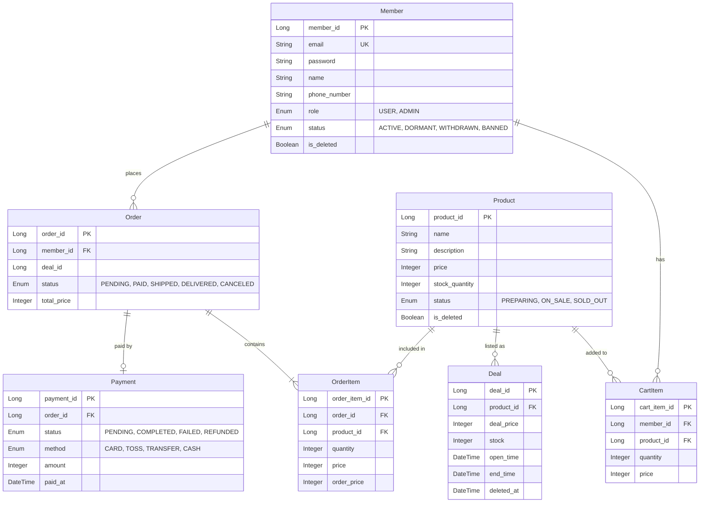
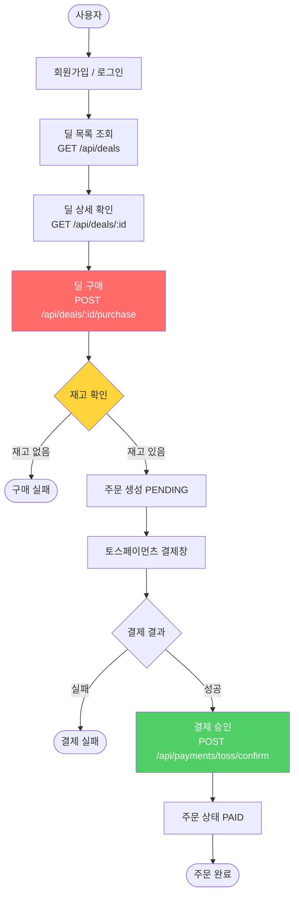
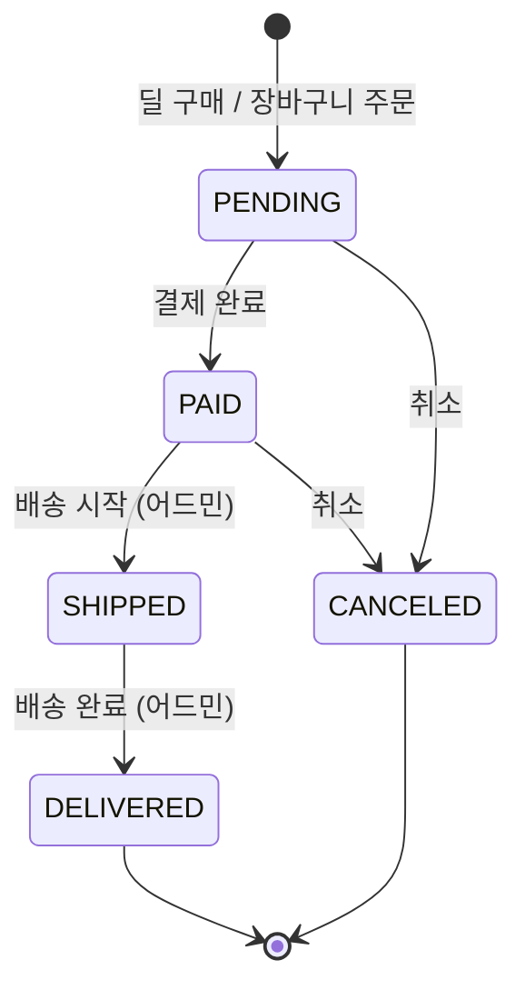

# Flash Deal

> 대규모 트래픽 상황에서 동시성 이슈와 병목을 직접 터트려보며, 분산 아키텍처가 왜 필요한지 데이터로 증명하는 포트폴리오입니다.

---

## 목차

1. [프로젝트 소개](#1-프로젝트-소개)
2. [기술 스택](#2-기술-스택)
3. [아키텍처 진화](#3-아키텍처-진화)
4. [ERD](#4-erd)
5. [사용자 플로우](#5-사용자-플로우)
6. [기술적 의사결정](#6-기술적-의사결정)
7. [성능 지표 비교](#7-성능-지표-비교)
8. [트러블슈팅](#8-트러블슈팅)
9. [API 명세](#9-api-명세)
10. [실행 방법](#10-실행-방법)

---

## 1. 프로젝트 소개

Flash Deal은 한정판 상품을 선착순으로 구매하는 이커머스 플랫폼입니다.
수천~수만 명이 동시에 같은 상품을 구매하려 할 때 발생하는 문제를 단계적으로 해결합니다.

**핵심 스토리:** 서비스 성장 -> 병목 발생 -> 기술 비교 분석 -> 채택 근거 제시 -> 개선

### 브랜치 구조

```
dev                  <- 통합 브랜치 (이 문서)
├── v1/single-server <- 단일 서버: 문제 재현 + 부하테스트
├── v2/scale-out     <- 스케일아웃: 기술 비교 + 개선 [예정]
└── v3/msa           <- MSA: 최종 성능 지표 [예정]
```

### 핵심 도메인

| 도메인 | 설명 |
|--------|------|
| Deal | 한정 수량 / 한정 시간 특가 상품 |
| Member | 회원가입 / 로그인 / 프로필 |
| Order | 딜 구매 및 일반 장바구니 주문 |
| Payment | 토스페이먼츠 연동 결제 |
| Product | 일반 상품 카탈로그 |
| Cart | 장바구니 |

---

## 2. 기술 스택

### Backend

| 분류 | 기술 | 선택 이유 |
|------|------|-----------|
| Framework | Spring Boot 3.5 / Java 17 | 생산성, 넓은 생태계 |
| ORM | Spring Data JPA + Querydsl | 타입 안전 동적 쿼리 |
| Security | Spring Security (세션) | V2에서 Redis 세션으로 자연스럽게 확장 가능 |
| DB | MySQL 8.0 | InnoDB 행 수준 락, 트랜잭션 정합성 |
| Connection Pool | HikariCP | Spring Boot 기본, 고성능 |
| Monitoring | Micrometer + Prometheus + Grafana | 커스텀 메트릭 수집 및 시각화 |
| API Docs | SpringDoc OpenAPI | 자동 문서화 |

### Frontend

| 분류 | 기술 |
|------|------|
| Framework | Next.js 14 (App Router) |
| Language | TypeScript |
| UI | Tailwind CSS + shadcn/ui |
| 결제 | Toss Payments SDK |

### Infrastructure

| 분류 | 기술 |
|------|------|
| 컨테이너 | Docker / Docker Compose |
| 서버 | NCP S3-g3 (vCPU 2코어 / RAM 8GB) |
| 부하테스트 | Apache JMeter 5.6 |

### 버전별 추가 기술

| 버전 | 기술 | 목적 |
|------|------|------|
| V2 | Redis, Nginx | 세션 공유, 로드밸런싱 |
| V3 | Kafka, Resilience4j | 서비스 간 이벤트 버스, Circuit Breaker |

---

## 3. 아키텍처 진화

### V1: 단일 서버

> 브랜치: `v1/single-server` | 테스트: 5,000명 동시 접속

```
[클라이언트 5,000명]
         |
         v
+----------------------------------+
|  NCP S3-g3 (2vCPU / 8GB RAM)    |
|                                  |
|  Spring Boot App :8080           |
|  MySQL 8.0       :3306           |
|  HikariCP Pool   = 10 (제한)     |
|  Prometheus      :9090           |
|  Grafana         :3000           |
+----------------------------------+
```

> 📸 **[이미지]** 부하테스트 후 캡처하여 추가 → `docs/images/v1-architecture.png`
>
> 예: draw.io 또는 Excalidraw로 위 구성도를 시각화

**재현 문제:**
- Race Condition → 재고 음수 발생
- FakePaymentClient(750ms)가 `@Transactional` 내부에서 DB 커넥션 점유 → Pool 고갈
- 2vCPU에서 App + MySQL + 모니터링 동시 실행 → CPU 100%
- P99 응답시간 > 10초 → 서버 실질적 다운

---

### V2: 로드밸런서 + 3 앱 서버 [예정]

> 브랜치: `v2/scale-out` | 테스트: 15,000명 동시 접속

```
[클라이언트 15,000명]
         |
    [Nginx LB]
    +----+----+
    |    |    |
  App  App  App
 8081 8082 8083
    +----+----+
         |
   +-----+-----+
   | MySQL      |
   | Redis      |  <- 세션 공유
   +------------+
```

> 📸 **[이미지]** V2 구현 후 추가 → `docs/images/v2-architecture.png`

**개선 내용:** 비관적 락 / 트랜잭션 분리 / Spring Session + Redis

**V2에서 발견되는 새 문제:** 딜 구매 트래픽 폭증 → 공유 MySQL 포화 → 상품 조회·주문 API까지 함께 느려짐 (Cascading Failure) → V3 MSA 분리의 근거

---

### V3: MSA [예정]

> 브랜치: `v3/msa` | 테스트: 30,000명 동시 접속

```
[클라이언트 30,000명]
         |
    [Nginx LB]
         |
    +----+------------------+
    |                       |
[메인 서비스]           [딜 서비스]
상품/주문/회원           한정판 딜 구매
[Main MySQL]            [Deal MySQL]
    |                   [Redis: 재고 DECR]
    |                       |
    +------- Kafka ----------+
           (이벤트 버스)
  deal.purchased 이벤트 발행
    -> 메인 서비스 주문 생성
    -> 딜 서비스 재고 확정

Resilience4j Circuit Breaker
  딜 서비스 장애 시 메인 서비스 즉시 격리
```

> 📸 **[이미지]** V3 구현 후 추가 → `docs/images/v3-architecture.png`

**개선 내용:** Redis Lua 재고 관리 / Kafka 서비스 간 이벤트 / DB 분리 / Circuit Breaker

---

## 4. ERD



> 📸 **[이미지]** ERD 툴(DBeaver, dbdiagram.io 등)로 시각화 후 추가 → `docs/images/erd.png`
>
> GitHub에서는 위 Mermaid 다이어그램이 바로 렌더링됩니다.

### 설계 포인트

| 포인트 | 설명 |
|--------|------|
| Deal.stock 분리 | Product.stock_quantity와 별도 관리 → 딜 재고만 독립 제어 |
| OrderItem.price 스냅샷 | 주문 시점 단가 저장 → 이후 가격 변경과 무관하게 보존 |
| Deal.deleted_at | Soft delete → 삭제된 딜도 기존 주문에서 조회 가능 |
| Order.deal_id (FK 없음) | 느슨한 참조 → V3 MSA 분리 시 별도 DB 이전 용이 |

---

## 5. 사용자 플로우

### 딜 구매 플로우 (핵심 시나리오)



> 📸 **[이미지]** 더 정교한 플로우차트는 Figma / draw.io로 작성 후 추가 → `docs/images/user-flow-deal.png`

### 주문 상태 머신



### 일반 쇼핑 플로우

```
사용자
 |
 +-- 상품 탐색: GET /api/products
 |
 +-- 장바구니: POST /api/carts
 |             PATCH /api/carts/:id (수량 변경)
 |             DELETE /api/carts/:id (삭제)
 |
 +-- 주문: POST /api/orders/from-cart
 |         POST /api/orders/direct (바로 구매)
 |
 +-- 결제: POST /api/payments/toss/confirm
 |
 +-- 배송 추적: GET /api/orders/:id
```

---

## 6. 기술적 의사결정

### 6-1. Race Condition 해결: 동시성 제어 전략

> V1에서 재고 음수 확인 → V2에서 비관적 락 채택 → V3에서 Redis DECR로 전환

| 방식 | 장점 | 단점 | 결정 |
|------|------|------|------|
| 낙관적 락 (`@Version`) | 충돌 없을 때 성능 우수 | 고경합 시 재시도 폭풍, 실패율 90%+ | X |
| 비관적 락 (`SELECT FOR UPDATE`) | 순서 보장, 정합성 확실 | 직렬화 -> TPS 한계 | V2 채택 |
| Redis DECR (Lua 스크립트) | 락 없이 원자적, 초고속 | Redis-DB 정합성 관리 필요 | V3 채택 |

**낙관적 락을 버린 이유:** 선착순 딜은 수천 명이 동시에 같은 row를 건드리는 고경합 환경.
충돌 시 재시도가 오히려 더 많은 DB 부하를 만들어 99%가 실패하는 상황이 발생한다.

---

### 6-2. DB 커넥션 고갈 해결: 트랜잭션 분리

> V1: FakePaymentClient(750ms)가 `@Transactional` 내부에서 커넥션 점유

| 방식 | 커넥션 점유 | 최대 TPS | 결정 |
|------|------------|---------|------|
| 단일 TX (V1) | ~750ms | ~13 TPS | X |
| 2단계 TX 분리 (V2) | ~5ms | ~500 TPS | V2 채택 |

```
V1 단일 TX:
@Transactional (커넥션 획득)
  -> 재고 차감 + 주문 저장  (~5ms)
  -> 결제 API 호출          (500~1000ms) <- 커넥션 계속 점유!
커넥션 반환

V2 분리 TX:
Phase A @Transactional (~5ms): 재고 차감 + PENDING 주문 -> 커넥션 즉시 반환
Phase B no TX (~750ms):        외부 결제 API 호출
Phase C @Transactional (~5ms): 성공 -> PAID / 실패 -> 재고 복구
```

---

### 6-3. 세션 관리: 스케일아웃 시 불일치 해결

> V2: A서버 로그인 -> Nginx가 B서버 라우팅 -> 401 에러 재현

| 방식 | 장점 | 단점 | 결정 |
|------|------|------|------|
| Sticky Session | 설정 단순 | 서버 장애 시 세션 유실 | X |
| Spring Session + Redis | 코드 변경 최소 | Redis 단일 장애점 | V2 채택 |
| JWT | 완전 무상태 | 토큰 무효화 어렵, 대규모 리팩토링 | X |

---

### 6-4. 재고 관리: Redis DECR vs MySQL 락

> V3: MySQL 비관적 락의 처리량 한계 극복

| 방식 | TPS | 결정 |
|------|-----|------|
| MySQL 비관적 락 (V2) | ~500 | V2 |
| Redis DECR Lua (V3) | ~5,000 | V3 채택 |

```lua
-- 원자적 재고 차감 Lua 스크립트
local stock = redis.call('GET', KEYS[1])
if stock == false then return -2 end
if tonumber(stock) <= 0 then return -1 end
return redis.call('DECR', KEYS[1])
```

---

### 6-5. MSA 서비스 간 통신: Kafka 이벤트 버스

> V3: 딜 서비스 분리 후 서비스 간 통신 방식 결정

**문제 상황:** 딜 서비스를 MSA로 분리했는데, 서비스 간 통신을 동기 HTTP로 하면?
- 딜 서비스 장애 → 메인 서비스도 대기 → 분리의 의미가 없음

| 방식 | 장점 | 단점 | 결정 |
|------|------|------|------|
| 동기 HTTP (REST) | 구현 단순, 즉각 응답 | 딜 서비스 장애 시 메인 서비스도 블로킹 | X |
| @Async + REST | 논블로킹 | 서버 재시작 시 유실, 재시도 로직 복잡 | X |
| Kafka 이벤트 버스 | 느슨한 결합, 장애 격리, 메시지 내구성 | 인프라 복잡도 증가 | V3 채택 |

**Kafka 이벤트 플로우:**
```
[딜 서비스]
  딜 구매 처리 (재고 차감)
  -> Kafka 발행: "deal.purchased"
     { memberId, dealId, dealPrice, quantity }

[메인 서비스] Kafka Consumer
  "deal.purchased" 구독
  -> 주문 생성 (Order: PAID 상태)
  -> 결제 기록

딜 서비스 장애 발생 시:
  메인 서비스는 정상 동작 유지
  Kafka에 메시지가 쌓이고
  딜 서비스 복구 후 순차 처리 (유실 없음)
```

**채택 근거:** 한정판 딜 구매는 데이터 유실이 허용되지 않는다. 동기 HTTP는 딜 서비스 장애가 메인 서비스로 전파되는 문제가 있어 MSA의 핵심 목표인 장애 격리를 달성할 수 없다.

---

## 7. 성능 지표 비교

| 지표 | V1 단일 서버 | V2 스케일아웃 | V3 MSA |
|------|:----------:|:----------:|:-----:|
| 동시 사용자 | 5,000명 | 15,000명 | 30,000명 |
| P99 응답시간 | > 10초 (다운) | ~3초 | < 100ms |
| 재고 정합성 | **음수 발생** | 정확 (비관적 락) | 정확 (Redis) |
| 딜 TPS | ~13 | ~500 | ~5,000 |
| 딜 장애 -> 메인 서비스 | 함께 다운 | 느려짐 | 정상 (CB) |
| 서비스 간 통신 | 단일 서버 | 동기 HTTP | Kafka 이벤트 |

> V2, V3 수치는 예상값 — 부하테스트 실행 후 실측값으로 업데이트 예정

### V1 부하테스트 결과

> 📸 **[이미지]** 부하테스트 실행 후 아래 캡처를 추가해주세요.

**Grafana 스크린샷 위치:**

| 파일명 | 내용 |
|--------|------|
| `docs/v1/grafana-race-condition.png` | 재고가 0 이하로 떨어지는 구간 |
| `docs/v1/grafana-hikaricp-exhausted.png` | hikaricp_connections_pending 급등 |
| `docs/v1/grafana-cpu-saturated.png` | system_cpu_usage = 100% |
| `docs/v1/grafana-p99-response-time.png` | P99 > 10초 구간 |

**JMeter 결과 위치:**

| 파일명 | 내용 |
|--------|------|
| `docs/v1/jmeter-aggregate-report.png` | Aggregate Report (P99, 에러율) |
| `docs/v1/jmeter-summary.png` | Summary Report 전체 |

**재고 음수 증거:**

| 파일명 | 내용 |
|--------|------|
| `docs/v1/mysql-stock-negative.png` | `SELECT stock FROM deal WHERE deal_id=1` -> 음수 값 |

---

## 8. 트러블슈팅

### V1 개선 포인트 요약

V1은 문제를 의도적으로 재현하는 단계이므로, 아래 이슈들을 인지한 상태에서 V2에서 순차 해결한다.

| # | 분류 | 문제 | 해결 버전 |
|---|------|------|---------|
| 1 | 동시성 | 재고 Race Condition — 락 없는 SELECT | V2 |
| 2 | 트랜잭션 | 결제 클라이언트가 TX 내부에서 DB 커넥션 점유 | V2 |
| 3 | N+1 쿼리 | 딜 목록 조회 시 상품 정보 N번 추가 쿼리 | V2 |
| 4 | 인덱스 부재 | deleted_at, open_time/end_time 컬럼 Full Scan | V2 |
| 5 | 중복 구매 | 같은 유저가 같은 딜 중복 구매 가능 | V2 |
| 6 | 장애 격리 없음 | 딜 서비스 과부하 → 전체 서비스 마비 | V3 |

---

### [V1] Race Condition: 재고가 음수가 된다

**증상:** 재고 100개인 딜에 5,000명 동시 요청 -> 최종 재고 음수 (-47 등)

**원인:**
```java
// DealService.purchase() - No Lock
Deal deal = dealRepository.findById(dealId);  // Thread A: stock=1 읽음
Deal deal = dealRepository.findById(dealId);  // Thread B: stock=1 읽음 (동시!)
deal.decreaseStock(1);  // Thread A -> stock=0 저장
deal.decreaseStock(1);  // Thread B -> stock=0 저장 (실제론 -1이어야 함)
```

**해결 (V2):** `SELECT ... FOR UPDATE` 비관적 락

> 📸 `docs/v1/grafana-race-condition.png` — Grafana에서 재고 음수 구간 캡처

---

### [V1] HikariCP Pool 고갈: 요청이 30초씩 대기한다

**증상:** `hikaricp_connections_pending` 폭증 -> 30초 Connection Timeout 대량 발생

**원인:**
```
풀 사이즈 10개 x 평균 점유 750ms = 최대 ~13 TPS
5,000명 동시 요청 -> 4,987명 대기 -> 타임아웃
```

**해결 (V2):** 트랜잭션 분리로 커넥션 점유 시간 750ms -> 5ms 단축

> 📸 `docs/v1/grafana-hikaricp-exhausted.png` — pending 연결 수 급등 캡처

---

### [V1] N+1 쿼리: 딜 목록 조회 시 쿼리가 N+1번 나간다

**증상:** `GET /api/deals` 호출 시 딜 10개면 쿼리 11번 실행

**원인:**
```java
// DealRepository: 딜 목록 1번 조회
dealRepository.findAllByDeletedAtIsNull(pageable);  // 쿼리 1번

// DealSummaryResponse.from(deal) 내부:
deal.getProduct().getName()  // 딜마다 Product 지연 로딩 → 쿼리 N번
```

```sql
-- 실제 발생하는 쿼리
SELECT * FROM deal WHERE deleted_at IS NULL LIMIT 10;  -- 1번
SELECT * FROM product WHERE product_id = 1;             -- deal 1
SELECT * FROM product WHERE product_id = 2;             -- deal 2
SELECT * FROM product WHERE product_id = 3;             -- deal 3
-- ... 총 N+1번
```

**해결 (V2):** `JOIN FETCH` 또는 `@EntityGraph`로 한 번에 조회
```java
@Query("SELECT d FROM Deal d JOIN FETCH d.product WHERE d.deletedAt IS NULL")
Page<Deal> findAllWithProduct(Pageable pageable);
```

---

### [V1] 인덱스 부재: 딜 조회가 항상 Full Scan이다

**증상:** 딜 데이터가 많아질수록 `GET /api/deals` 응답 시간 선형 증가

**원인:** 자주 사용하는 WHERE 조건 컬럼에 인덱스 없음

```sql
-- findAllByDeletedAtIsNull → deleted_at Full Scan
SELECT * FROM deal WHERE deleted_at IS NULL;

-- isOpen() 체크 → open_time, end_time Full Scan
SELECT * FROM deal WHERE open_time <= NOW() AND end_time > NOW();
```

**해결 (V2):** 엔티티에 인덱스 추가
```java
@Table(name = "deal", indexes = {
    @Index(name = "idx_deal_deleted_at", columnList = "deleted_at"),
    @Index(name = "idx_deal_open_time",  columnList = "open_time"),
    @Index(name = "idx_deal_end_time",   columnList = "end_time")
})
```

---

### [V1] 중복 구매 미방지: 같은 딜을 여러 번 살 수 있다

**증상:** 동일 유저가 `POST /api/deals/1/purchase` 반복 호출 → 재고 과다 차감

**원인:** 구매 전 중복 여부 체크 로직 없음

**해결 (V2):**
```java
// 서비스 레벨 중복 체크
boolean alreadyPurchased = orderRepository
    .existsByMemberIdAndDealId(memberId, dealId);
if (alreadyPurchased) {
    throw new DealException(DealErrorCode.ALREADY_PURCHASED);
}
```

---

### [V2] 세션 불일치: 로그인했는데 401이 뜬다

**증상:** A서버 로그인 -> Nginx가 B서버로 라우팅 -> 세션 없음 -> 401

**해결 (V2):** Spring Session + Redis 세션 공유

---

### [V2] Cascading Failure: 딜 트래픽이 일반 API를 죽인다

**증상:** 딜 구매 폭증 -> 공유 MySQL 포화 -> 상품 조회 API도 느려짐

**해결 (V3):** 딜 서비스 DB 분리 + Resilience4j Circuit Breaker

---

## 9. API 명세

### 인증

| Method | Endpoint | 설명 |
|--------|----------|------|
| POST | `/api/auth/signup` | 회원가입 |
| POST | `/api/auth/login` | 로그인 |
| POST | `/api/auth/logout` | 로그아웃 |

### 딜 (핵심)

| Method | Endpoint | 설명 | Auth |
|--------|----------|------|------|
| GET | `/api/deals` | 딜 목록 | - |
| GET | `/api/deals/{dealId}` | 딜 상세 | - |
| POST | `/api/deals/{dealId}/purchase` | **딜 구매 (선착순)** | 필요 |
| POST | `/api/admin/deals` | 딜 생성 | ADMIN |
| POST | `/api/admin/deals/{dealId}/reset` | 재고 초기화 (테스트) | ADMIN |

### 주문

| Method | Endpoint | 설명 | Auth |
|--------|----------|------|------|
| POST | `/api/orders/from-cart` | 장바구니 -> 주문 | 필요 |
| POST | `/api/orders/direct` | 바로 구매 | 필요 |
| GET | `/api/orders` | 내 주문 목록 | 필요 |
| GET | `/api/orders/{orderId}` | 주문 상세 | 필요 |
| DELETE | `/api/orders/{orderId}` | 주문 취소 | 필요 |
| PATCH | `/api/admin/orders/{id}/ship` | 배송 시작 | ADMIN |
| PATCH | `/api/admin/orders/{id}/deliver` | 배송 완료 | ADMIN |

### 결제

| Method | Endpoint | 설명 | Auth |
|--------|----------|------|------|
| POST | `/api/payments/toss/confirm` | 토스 결제 승인 | 필요 |
| GET | `/api/payments/{paymentId}` | 결제 조회 | 필요 |
| POST | `/api/payments/{paymentId}/refund` | 환불 | 필요 |

### 상품 / 장바구니 / 회원

| Method | Endpoint | 설명 |
|--------|----------|------|
| GET | `/api/products` | 상품 목록 |
| GET | `/api/products/{id}` | 상품 상세 |
| POST | `/api/carts` | 장바구니 추가 |
| GET | `/api/carts` | 장바구니 조회 |
| GET | `/api/members/me` | 내 프로필 |
| PATCH | `/api/members/me` | 프로필 수정 |

> 전체 Swagger: `http://localhost:8080/swagger-ui/index.html`

---

## 10. 실행 방법

### 사전 준비

- Docker Desktop
- JDK 17 이상
- Node.js 18 이상

### 로컬 실행

```bash
# 1. 인프라 시작 (MySQL + Prometheus + Grafana)
docker-compose up -d

# 2. 백엔드 실행
./gradlew bootRun --args='--spring.profiles.active=dev'

# 3. 프론트엔드 실행 (별도 터미널)
cd frontend
npm install
npm run dev
```

### 접속 주소

| 서비스 | URL | 계정 |
|--------|-----|------|
| Backend API | http://localhost:8080 | - |
| Swagger UI | http://localhost:8080/swagger-ui/index.html | - |
| Frontend | http://localhost:3001 | - |
| Grafana | http://localhost:3000 | admin / admin |
| Prometheus | http://localhost:9090 | - |

### 부하테스트 (V1 브랜치)

```bash
git checkout v1/single-server

# 테스트 유저 CSV 생성
./load-test/generate-users-csv.sh 5000

# 재고 초기화
curl -c cookies.txt -X POST http://localhost:8080/api/auth/login \
  -H "Content-Type: application/json" \
  -d '{"email":"admin@test.com","password":"test1234"}'

curl -b cookies.txt -X POST \
  "http://localhost:8080/api/admin/deals/1/reset?stock=100"

# JMeter 실행
jmeter -n \
  -t load-test/v1-5000users.jmx \
  -l docs/v1/results.jtl \
  -e -o docs/v1/report/
```

### 테스트 계정

| 구분 | 이메일 | 비밀번호 |
|------|--------|---------|
| 관리자 | admin@test.com | test1234 |
| 일반 유저 | user1@test.com ~ user10000@test.com | test1234 |
