<div align="center">

# ⚡ Flash Deal

</div>


선착순 한정 수량 상품을 구매할 수 있는 이커머스 플랫폼입니다.
회원가입/로그인부터 상품 탐색, 장바구니, 주문, 결제, 리뷰까지 이커머스 핵심 플로우를 구현했습니다.

---

## 📋 목차

- [✨ 프로젝트 소개](#-프로젝트-소개)
- [🛠️ 기술 스택](#️-기술-스택)
- [🏗️ 시스템 아키텍처](#️-시스템-아키텍처)
- [📊 ERD](#-erd)
- [💡 기술적 의사결정](#-기술적-의사결정)
- [🏛️ 도메인 설계 원칙](#️-도메인-설계-원칙)
- [📈 V1 부하 테스트 & 성능 최적화](#-v1-부하-테스트--성능-최적화)
- [🚀 V2 / Scale-Out 방향](#-v2--scale-out-방향)

---

## ✨ 프로젝트 소개

Flash Deal은 한정 수량 상품을 선착순으로 구매하는 이커머스 플랫폼입니다.

단순한 기능 구현을 넘어, 서비스가 성장하면서 마주치는 **실제 성능 병목을 직접 재현하고, 여러 기술을 비교·분석한 뒤 트레이드오프를 고려하여 해결책을 선택하는 과정**을 담은 포트폴리오 프로젝트입니다.

|                |                                                           |
|----------------|-----------------------------------------------------------|
| 🗓️ **개발 기간** | 2026.02 ~ 진행 중                                          |
| 👤 **개발 인원** | 1인 (개인 프로젝트)                                          |
| 🌐 **배포 URL** | https://flash-deal-eight.vercel.app                      |
| 📄 **API 명세** | https://flashdeal.서버.한국/swagger-ui/index.html           |

### 🗂️ 구현 도메인

| 도메인 | 주요 기능 |
|--------|----------|
| 🔐 Auth | 회원가입, 로그인, 로그아웃 |
| 👤 Member | 프로필 조회/수정, 비밀번호 변경 |
| 📦 Product | 상품 등록/수정/삭제/검색 (어드민), 상품 조회/검색 (일반) |
| 🛒 Cart | 장바구니 담기/조회/수량 수정/삭제/비우기 |
| 📝 Order | 장바구니 주문, 바로 구매, 주문 조회/취소, 배송 관리 (어드민) |
| 💳 Payment | 결제 처리, TossPayments 승인, 결제 조회, 환불 |
| ⭐ Review | 구매 확인 후 리뷰 작성, 상품별 리뷰 조회 |

---

## 🛠️ 기술 스택

<div align="center">

**Backend**


**Database**


**Infrastructure**


**Frontend**


**Testing**


</div>

---

## 🏗️ 시스템 아키텍처

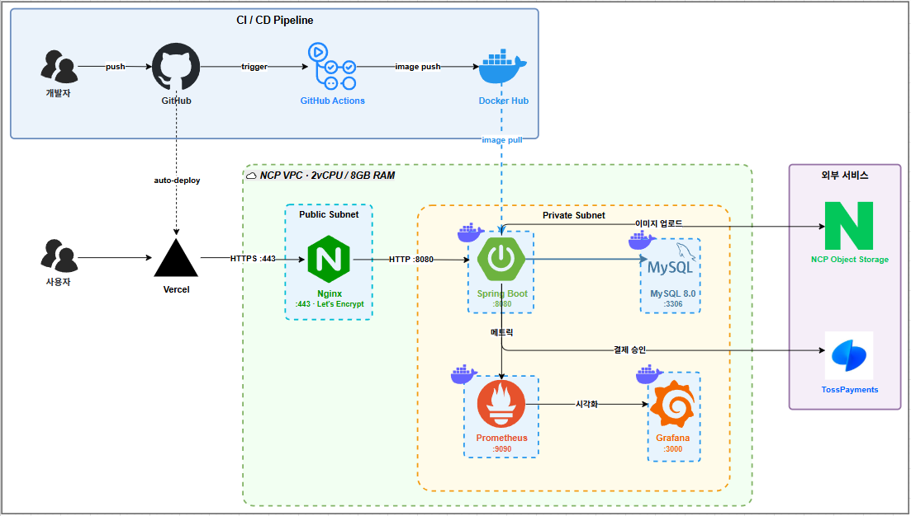

> 현재는 확장성을 위해 **App Server, Cloud DB (Managed), Monitoring Server**를 분리하여 운영 중입니다.

### 🔄 시퀀스 다이어그램 (주문 & 결제)


### 📁 패키지 구조

```
src/main/java/com/prj/flashdeal/
├── domain/
│   ├── auth/          # 인증 (회원가입, 로그인)
│   ├── member/        # 회원 관리
│   ├── product/       # 상품 관리
│   ├── stock/         # 재고 관리
│   ├── cart/          # 장바구니
│   ├── order/         # 주문
│   ├── payment/       # 결제
│   ├── deal/          # 선착순 딜
│   ├── review/        # 리뷰
│   └── file/          # 파일 업로드
└── global/
    ├── config/        # Security, QueryDSL, S3 설정
    ├── entity/        # BaseEntity (createdAt, updatedAt)
    ├── exception/     # 공통 예외 처리
    ├── response/      # ApiResponse, PageResponse
    └── security/      # CustomUserDetails, SecurityConfig
```

---

## 📊 ERD

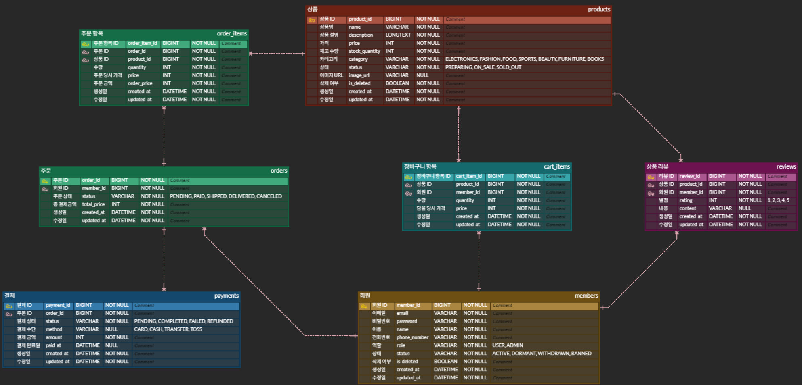

**주요 Enum 값**

| 테이블 | 컬럼 | 값 |
|--------|------|----|
| MEMBER | role | `USER`, `ADMIN` |
| MEMBER | status | `ACTIVE`, `DORMANT`, `WITHDRAWN`, `BANNED` |
| PRODUCT | status | `PREPARING`, `ON_SALE`, `SOLD_OUT` |
| ORDERS | status | `PENDING`, `PAID`, `SHIPPED`, `DELIVERED`, `CANCELED` |
| PAYMENT | status | `PENDING`, `COMPLETED`, `REFUNDED` |
| PAYMENT | method | `CARD`, `CASH`, `TRANSFER`, `TOSS` |

---

## 💡 기술적 의사결정

<details>
<summary><strong>🔐 "JWT가 더 좋다고요?" — 즉시 무효화가 필요한 서비스에서의 선택</strong></summary>

<br>

**배경**

인증 방식을 설계할 때 JWT와 세션 중 하나를 선택해야 했습니다. 많은 프로젝트에서 JWT가 "무상태, 스케일아웃에 유리"하다는 이유로 기본처럼 선택되지만, 먼저 이 서비스의 특성을 고민했습니다.

**고민**

| 방식 | 장점 | 단점 |
|------|------|------|
| **세션** | 서버에서 즉시 무효화 가능, 구현 단순 | 스케일아웃 시 서버 간 세션 공유 필요 |
| **JWT** | 무상태, 스케일아웃 용이 | 만료 전까지 서버가 토큰을 강제 무효화 불가 |

JWT의 근본적인 문제는 **"발급된 토큰은 만료 전까지 서버가 막을 수 없다"** 는 점입니다.
블랙리스트로 해결할 수 있지만, 결국 Redis 등 외부 저장소에 상태를 저장하는 것으로 **"무상태"라는 JWT의 핵심 장점이 퇴색**됩니다.

Flash Deal은 선착순 한정 수량 구매 플랫폼으로, 어뷰징 감지 시 **즉각적인 계정 차단**이 중요합니다. 이 요구사항 앞에서 JWT는 구조적으로 취약합니다.

**결론 — 세션 채택**

- 현재 단일 서버 환경에서 세션은 구현 복잡도가 낮고, 서버 측 즉시 무효화가 가능합니다
- JWT + 블랙리스트 조합은 "무상태"를 포기하면서도 세션보다 복잡합니다
- **이 서비스 규모에서 JWT의 장점(스케일아웃)은 아직 필요 없고, 단점(무효화 불가)은 치명적입니다**

**개선 계획 (V2)**

스케일아웃(3대 서버) 시 세션 불일치 문제 발생 → Spring Session + Redis로 세션 저장소를 외부화하여 해결 예정

</details>

---

<details>
<summary><strong>🔍 "런타임이 아닌 컴파일 타임에 잡는다" — QueryDSL 타입 안전 동적 쿼리</strong></summary>

<br>

**배경**

상품 검색은 이름, 상태, 가격 범위 등 조건이 동적으로 조합됩니다. 이를 구현하는 방법은 여러 가지가 있었습니다.

**고민**

| 방식 | 문제 |
|------|------|
| JPQL 문자열 조합 | 타입 안전하지 않음, 오타가 런타임에야 발견됨 |
| Specification | 코드 가독성 저하, 복잡한 조인 조건에서 한계 |
| **QueryDSL** | 타입 안전, IDE 자동완성, 컴파일 타임 오류 감지 |

**결론 — QueryDSL 채택**

```java
// 조건이 null이면 자동으로 무시되는 타입 안전한 동적 쿼리
BooleanBuilder builder = new BooleanBuilder();
if (name != null)     builder.and(product.name.containsIgnoreCase(name));
if (minPrice != null) builder.and(product.price.goe(minPrice));
if (maxPrice != null) builder.and(product.price.loe(maxPrice));
```

`*RepositoryCustom` 인터페이스 + `*RepositoryCustomImpl` 구현체 패턴으로 Spring Data JPA와 QueryDSL을 함께 사용합니다.
**컬럼명 오타나 타입 불일치는 컴파일 시점에 즉시 감지**됩니다.

</details>

---

## 🏛️ 도메인 설계 원칙

<details>
<summary><strong>🧩 "Service가 아닌 Entity가 스스로 검증한다" — Rich Domain Model 채택</strong></summary>

<br>

**배경**

비즈니스 규칙을 서비스 계층에만 두면 엔티티가 단순 데이터 컨테이너(Anemic Domain Model)로 전락하고, 같은 검증 로직이 여러 서비스에 흩어져 한 곳에서라도 빠뜨리면 바로 버그가 됩니다.

**고민**

| 방식 | 문제 |
|------|------|
| Anemic Domain Model | 검증 로직이 서비스마다 중복, 누락 시 버그 |
| **Rich Domain Model** | 엔티티가 자신의 상태를 스스로 지킴 |

**결론 — 핵심 규칙을 엔티티 메서드로 캡슐화**

```java
member.validateActive()         // ACTIVE가 아니면 즉시 예외
product.validateVisibleToUser() // ON_SALE + 미삭제가 아니면 즉시 예외
order.cancel()                  // 취소 가능 상태 검증 후 CANCELED 전환
order.ship() / order.deliver()  // 배송 상태 전환 시 순서 검증 포함
```

상태 변경과 검증이 엔티티 안에 있어 **서비스에서 검증을 빠뜨릴 가능성 자체가 사라지고**, 엔티티 단위 테스트만으로 핵심 비즈니스 규칙을 검증할 수 있습니다.

</details>

---

## 📈 V1 부하 테스트 & 성능 최적화

> 싱글 서버(NCP vCPU 2EA, 8GB RAM)에서 선착순 딜 주문의 성능 한계를 단계적으로 탐색하고,
> 병목 원인을 데이터로 증명한 뒤, 최적화 적용 후 Before/After를 비교한 기록입니다.

### 테스트 환경

| 항목 | 스펙                                             |
|------|------------------------------------------------|
| 서버 | NCP vCPU 2EA, RAM 8GB, Ubuntu                  |
| WAS | Spring Boot 3.5.6 (내장 Tomcat)                  |
| DB | **NCP Cloud DB for MySQL (vCPU 2EA, RAM 8GB)** |
| HikariCP | max-pool-size: 10 (기본값)                        |
| 세션 | In-Memory (서버 메모리)                             |
| 테스트 도구 | Apache JMeter 5.6.3                            |
| 모니터링 | **별도 모니터링 서버 구성 (Grafana + Prometheus)**       |

---

<details>
<summary><strong>"비관적 락 + 트랜잭션 분리" — 정합성은 해결, 하지만 성능은 여전히</strong></summary>

<br>

#### 최적화 1: 비관적 락 적용 (Race Condition 해결)

```java
// Before: lock 없는 조회
Stock stock = stockRepository.findByProductId(productId);

// After: SELECT FOR UPDATE — 한 트랜잭션씩 순차 처리
Stock stock = stockRepository.findByProductIdWithLock(productId);
```

#### 최적화 2: 트랜잭션 분리 (Connection Pool 고갈 해결)

Spring 프록시의 내부 호출 한계를 해결하기 위해 `DealOrderTransactionService`를 별도 빈으로 분리했습니다.

```java
// Before: 하나의 @Transactional에서 결제까지 실행 → 500~1000ms 커넥션 점유
@Transactional
public OrderResponse createDealOrder(...) {
    stockService.decreaseStock(...);
    fakePaymentClient.pay(...);
    order.completePayment(...);
}

// After: 트랜잭션 3단계 분리
public OrderResponse createDealOrder(...) {
    // TX1: 검증 + 재고 차감 → 커넥션 즉시 반환
    DealOrderContext ctx = dealOrderTxService.validateAndDecreaseStock(...);

    // 결제: 트랜잭션 밖 → DB 커넥션 미점유
    fakePaymentClient.pay(...);

    // TX2: 주문 생성 + 결제 완료
    return dealOrderTxService.completeOrder(ctx, request);
}
```

---

#### Before/After 종합 비교

| 동시 사용자 | Before 초과 판매 | After 초과 판매 | Before Error | After Error | Before Pending | After Pending |
|-----------|---------------|---------------|-------------|------------|---------------|--------------|
| 10명 | 9건 | **0건** | 30% | **0%** | 0 | 0 |
| 100명 | ~72건 | **0건** | 17% | **0%** | 3 | 16 |
| 300명 | ~205건 | **0건** | 21.33% | **0%** | 30 | 0 |
| 500명 | ~346건 | **0건** | 20.80% | **0%** | 164 | **4** |
| 1000명 | ~700건 | **0건** | 20.30% | **0.50%** | 42 | 0 |

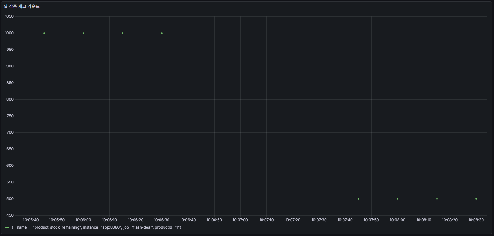
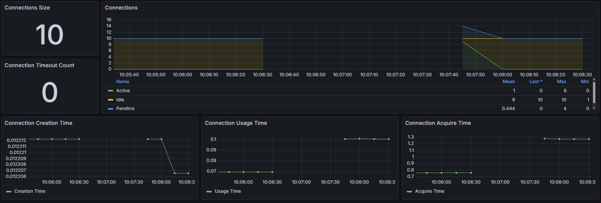

| 병목 | 해결 방법 | 효과 |
|------|---------|------|
| Race Condition | 비관적 락 (SELECT FOR UPDATE) | 초과 판매 0건 — **데이터 정합성 100% 보장** |
| Connection Pool 고갈 | 트랜잭션 분리 (결제를 TX 밖으로) | 500명 기준 Pending 164 → 4 **(97% 감소)** |

#### 최적화 후에도 남는 한계

| 한계 | 수치 (1000명 기준) | 원인 |
|------|------|------|
| 딜 주문 평균 응답시간 | **38초** | 비관적 락이 1000건을 순차 처리 |
| Connection Timeout | **5회** | 순차 처리로 인한 대기 시간 누적 |
| 모니터링 공백 | **약 2분** | 서버 자원 한계 |

비관적 락으로 **데이터 정합성은 완전히 해결**했지만, **처리 성능은 단일 서버 + 단일 DB의 물리적 한계**입니다.
여기서 바로 서버를 늘리는 것은 **"느린 서버를 3대 띄우는 것"** 에 불과합니다.
단일 서버에서 할 수 있는 최적화를 모두 시도하고, 그래도 한계가 올 때 비로소 스케일아웃의 근거가 됩니다.

</details>

---

<details>
<summary><strong>"쿼리를 91% 줄여도 TPS가 안 변한다?" — N+1 해결과 Caffeine 캐싱</strong></summary>

<br>

> 스케일아웃 전에 단일 서버에서 뽑아낼 수 있는 최대 성능을 먼저 확인한다.
> 최적화 항목별로 **단일 API 테스트**(100 Threads, Duration 60초)로 효과를 격리 측정한다.

#### 딜 목록 조회 — N+1 쿼리 해결

Hibernate SQL 로그를 분석한 결과, 딜 목록 조회 1회에 **22개 쿼리**가 발생했다.

```
요청 1회 → 22개 쿼리
├── SELECT ... FROM deals LIMIT ?, ?              (1개: 딜 목록)
├── SELECT count(deal_id) FROM deals              (1개: 페이징 count)
├── SELECT ... FROM stocks WHERE product_id=?     (10개: 딜마다 재고 N+1)
└── SELECT ... FROM products WHERE product_id=?   (10개: 딜마다 상품 N+1)
```

QueryDSL JOIN + DTO Projection으로 **22개 → 2개 쿼리**로 통합했다.

```java
queryFactory
    .select(Projections.constructor(DealResponse.class, ...))
    .from(deal)
    .join(deal.product, product)
    .leftJoin(stock).on(stock.productId.eq(product.id))
    .orderBy(deal.createdAt.desc())
    .offset(pageable.getOffset())
    .limit(pageable.getPageSize())
    .fetch();
```

| 지표 | Before (N+1) | After (JOIN) | 변화 |
|------|-------------|-------------|------|
| 쿼리 수 | 22개 | 2개 | **91% 감소** |
| TPS | 31.4/sec | 30.0/sec | **거의 동일** |

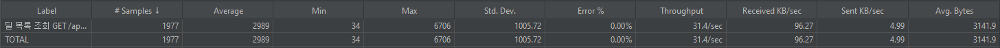
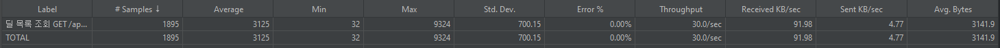

> 쿼리를 91% 줄였는데 TPS가 변하지 않았다. **HikariCP 커넥션 풀(10개)이 진짜 병목**이기 때문이다.
> 쿼리를 아무리 줄여도 커넥션 10개라는 물리적 한계는 그대로 → **DB 접근 자체를 제거해야 한다.**

---

#### 딜 목록 조회 — Caffeine 로컬 캐시 적용

| 결정 | 이유 |
|------|------|
| **Caffeine (로컬 캐시)** 채택 | 단일 서버에서는 JVM 내 캐시가 네트워크 비용 없이 가장 빠름 |
| Redis 배제 | 다중 서버 간 캐시 일관성이 필요한 V2에서 도입 |
| TTL 5초 | 재고 변동을 적절히 반영하면서 DB 부하를 줄이는 균형점 |

```java
@Cacheable(value = "deals", key = "#pageable.pageNumber + '-' + #pageable.pageSize")
@Transactional(readOnly = true)
public PageResponse<DealResponse> getDeals(Pageable pageable) {
    Page<DealResponse> page = dealRepository.findDealsWithStock(pageable);
    return new PageResponse<>(page);
}
```

**100명 테스트:**

| 지표 | Before (JOIN만) | After (JOIN + Cache) | 개선율 |
|------|----------------|---------------------|-------|
| Avg 응답시간 | 3,125ms | **23ms** | **99.3% 감소** |
| TPS | 30.0/sec | **4,037.9/sec** | **134배 증가** |

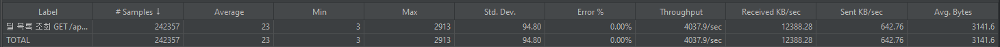

**300명으로 부하 증가:**

| 지표 | 100명 | 300명 | 변화 |
|------|-------|-------|------|
| TPS | 4,037.9/sec | **1,406.7/sec** | **65% 감소** |
| CPU Max | 71.5% | 포화 | - |

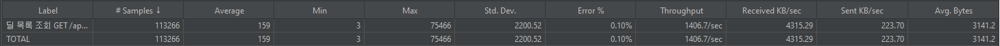
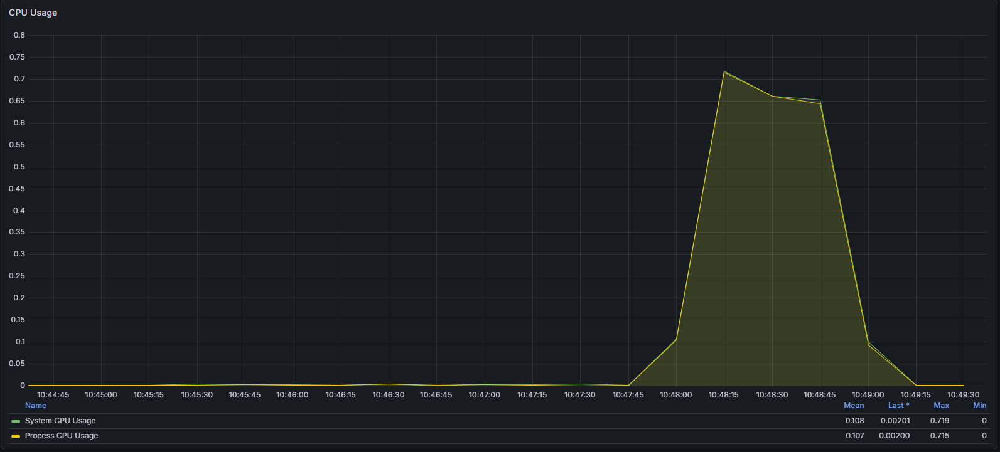

> 캐시로 DB 병목은 해결했지만, **새로운 병목 — CPU 2코어.** 300명에서는 컨텍스트 스위칭 오버헤드로 TPS가 오히려 떨어진다.

---

#### 딜 상세 조회 — QueryDSL JOIN + 캐시 적용

LAZY 로딩으로 인한 3개 쿼리를 1개로 통합하고, Caffeine 캐시를 적용했다.

| 지표 | Before (JOIN만) | After (JOIN + Cache) | 개선율 |
|------|----------------|---------------------|-------|
| Avg 응답시간 | 67ms | **20ms** | **70% 감소** |
| TPS | 1,425.4/sec | **4,699.7/sec** | **3.3배 증가** |

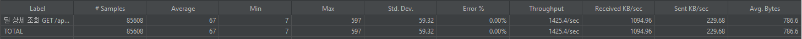
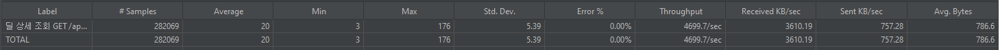

---

#### 딜 주문 — 비관적 락의 물리적 한계

딜 주문은 `SELECT ... FOR UPDATE`로 재고 정합성을 보장하므로 반드시 DB를 거쳐야 하며, 캐싱 대상이 아니다.

| 지표 | 100명 | 300명 | 변화 |
|------|-------|-------|------|
| 딜 주문 TPS | 12.9/sec | **12.8/sec** | **변화 없음** |
| 딜 주문 Avg | 6,824ms | 17,938ms | 대기 시간만 증가 |

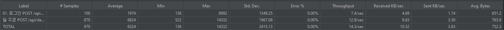
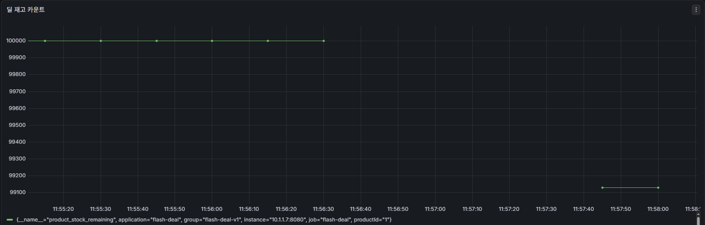

> 100명이든 300명이든 TPS ~12.9로 동일. **단일 MySQL row lock은 초당 ~13건이 물리적 한계.**

---

#### 최적화 종합

| API | Before Avg | Before TPS | After Avg | After TPS | 개선율 |
|-----|-----------|-----------|----------|----------|-------|
| 딜 목록 조회 | 2,989ms | 31.4 | **23ms** | **4,037.9** | **130배** |
| 딜 상세 조회 | 67ms | 1,425.4 | **20ms** | **4,699.7** | **3.3배** |
| 딜 주문 | 6,824ms | 12.9 | 6,824ms | 12.9 | **변화 없음** |

조회 API는 극적으로 개선했지만, 주문 API는 **비관적 락이라는 구조적 한계** 때문에 코드 레벨로는 더 이상 개선할 수 없다.

</details>

---

<details>
<summary><strong>"100명은 버티지만 300명은 무너진다" — 시나리오 테스트와 단일 서버의 한계</strong></summary>

<br>

> 단일 API 테스트에서는 각 API가 최대 성능을 보여줬지만, 실제 서비스는 **로그인 + 조회 + 주문이 동시에 발생**한다.
> 모든 최적화를 적용한 상태에서 시나리오 테스트로 최종 검증한다.

```
1. 로그인 POST /api/auth/login     (Once Only Controller — 스레드당 1회)
2. 전원 로그인 완료 대기             (Synchronizing Timer)
3. 딜 목록 조회 GET /api/deals      ← Think Time 1~3초 (Uniform Random Timer)
4. 딜 상세 조회 GET /api/deals/{id} ← Think Time 1~3초
5. 딜 주문 POST /api/deals/{id}/order
```

---

#### 100명 — SLO 전면 충족

| API | Avg (ms) | Error % | TPS |
|-----|----------|---------|-----|
| 로그인 | 189 | 0% | 14.8/sec |
| 딜 목록 조회 | **21** | 0% | 11.6/sec |
| 딜 상세 조회 | **153** | 0% | 11.7/sec |
| 딜 주문 | **945** | 0% | 11.4/sec |

| 인프라 | 값 |
|-------|-----|
| CPU Max | 74.5% |
| Connection Timeout | 7 |
| 재고 | 100,000 → **99,400** (600건 정확 차감) |

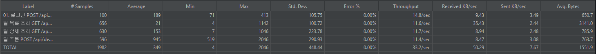
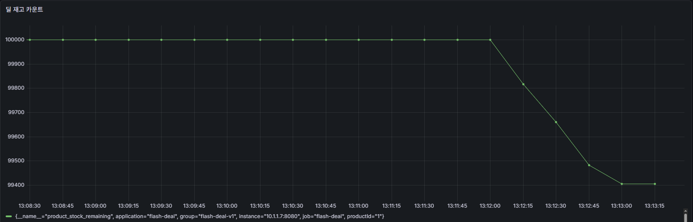
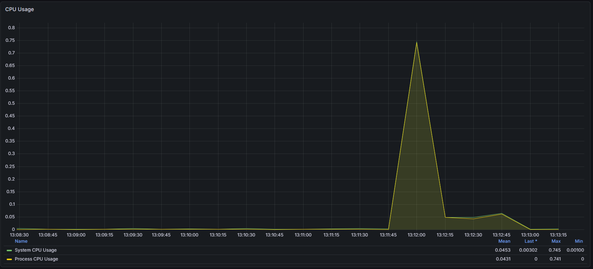
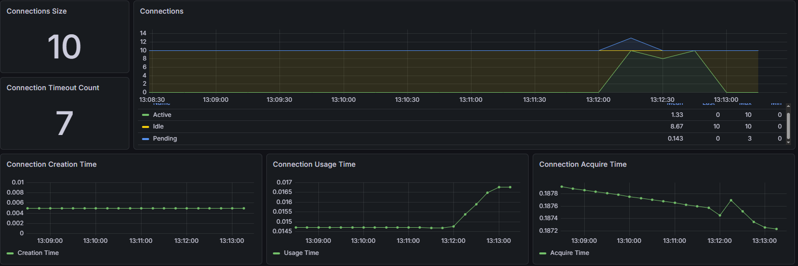

> 딜 목록 21ms, 딜 상세 153ms, 딜 주문 945ms — 모두 SLO 이내. 100명까지는 단일 서버로 안정적이다.

---

#### 300명 — SLO 전면 위반

| API | Avg (ms) | Error % | TPS |
|-----|----------|---------|-----|
| 로그인 | **2,151** | 0% | 29.3/sec |
| 딜 목록 조회 | **1,214** | 0% | 13.7/sec |
| 딜 상세 조회 | **5,447** | 0% | 12.9/sec |
| 딜 주문 | **7,196** | 0% | 12.3/sec |

| 인프라 | 값 |
|-------|-----|
| CPU Max | **0.7%** (처리를 못하고 있음) |
| HikariCP Active | **0** (커넥션 획득 자체가 안 됨) |
| 재고 | 100,000 → **~99,270** (극소량 차감) |

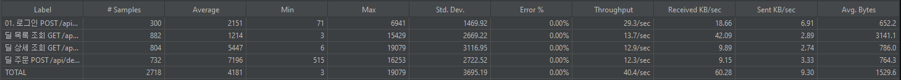
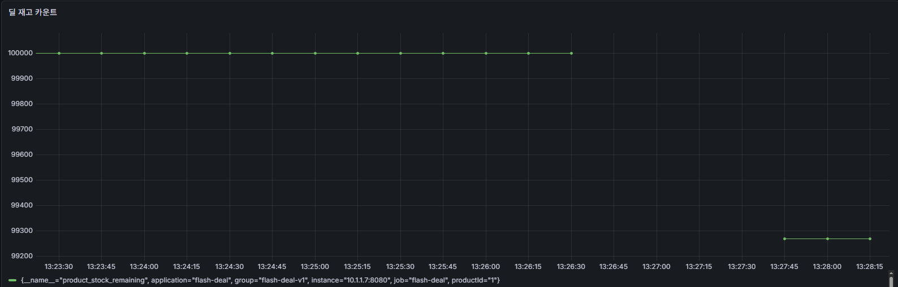
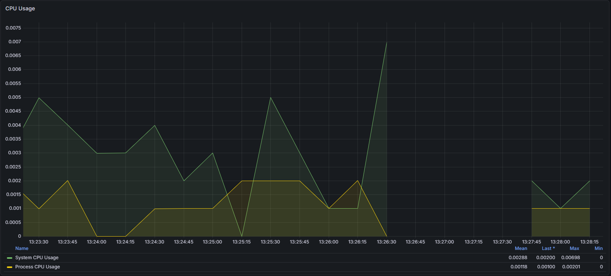
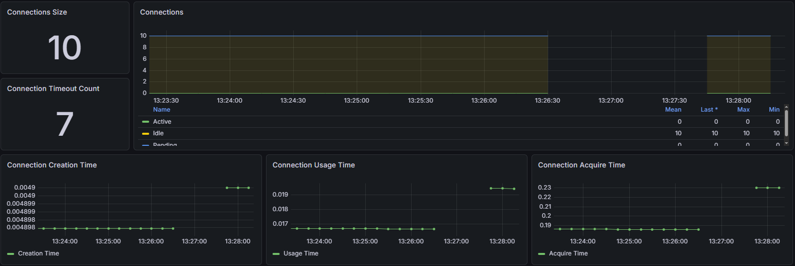

---

#### 왜 300명에서 무너지는가?

| API | 100명 Avg | 300명 Avg | 악화 |
|-----|-----------|-----------|------|
| 딜 목록 조회 | 21ms | **1,214ms** | **58배** |
| 딜 상세 조회 | 153ms | **5,447ms** | **36배** |
| 딜 주문 | 945ms | **7,196ms** | 7.6배 |

**핵심 원인: 커넥션 풀 경합 + 직렬 파이프라인 효과**

1. **주문 API가 커넥션을 독점한다** — `SELECT FOR UPDATE`로 한 번에 1건만 처리. 10개 커넥션이 락 대기에 묶인다.
2. **조회 API도 커넥션을 못 받는다** — 캐시 MISS 시 DB 커넥션이 필요한데, 커넥션이 모두 주문에 점유당해 대기열에 갇힌다.
3. **파이프라인 전체가 누적 지연된다** — 앞 단계가 느려지면 뒤 단계도 밀린다.

**증거:** CPU 0.7%(처리를 못하는 것), HikariCP Active 0(커넥션 획득 불가), 재고 거의 미차감(주문 미처리)

---

#### 결론 — 단일 서버의 세 가지 물리적 한계

| 한계 | 증거 | 원인 |
|------|------|------|
| **CPU 2코어** | 캐시 적용 후 100명 CPU 71.5%, 300명에서 TPS 하락 | 컨텍스트 스위칭 오버헤드 |
| **비관적 락 직렬화** | 주문 TPS ~12.9 고정 (스레드 수 무관) | 단일 MySQL row lock |
| **커넥션 풀 10개 공유** | 300명 시나리오에서 전체 API 응답시간 폭증 | 주문이 커넥션 독점 → 조회까지 연쇄 지연 |

이 세 가지는 **코드가 아니라 인프라의 제약**이다. 캐시, JOIN, 트랜잭션 분리는 이미 적용했고, 남은 병목은 **서버 한 대의 물리적 자원**과 **단일 DB의 락 구조**다.

#### V2 스케일아웃 방향

| 한계 | V2 해결 방향 |
|------|------------|
| CPU 2코어 | 앱 서버 **3대** + Nginx 로드밸런서 |
| 비관적 락 TPS 한계 | **Redis Lua Script**로 atomic 재고 차감 |
| 커넥션 풀 경합 | 서버 3대 = 커넥션 **30개** |
| 세션 불일치 | **Spring Session + Redis** |

</details>

---

## 🚀 V2 / Scale-Out 방향

V1은 단일 서버와 단일 DB 안에서 할 수 있는 최적화를 최대한 적용해 한계를 확인하는 단계였습니다.
V2의 목표는 그 한계를 없애는 것이 아니라, **어떤 병목을 어떤 방식으로 분산 환경으로 넘길지 명확하게 설계하는 것**입니다.

### 왜 V2가 필요한가

| V1 한계 | 현재 원인 | V2 방향 |
|------|------|------|
| 주문 TPS가 약 13/sec 수준에서 고정 | MySQL row-level 비관적 락 직렬화 | Redis Lua Script 기반 atomic 재고 차감 |
| 300명 시나리오에서 전체 API 지연 폭증 | 주문이 커넥션을 점유해 조회까지 연쇄 지연 | 앱 서버 다중화 + 커넥션 분산 |
| CPU 2코어 한계로 조회 TPS 하락 | 단일 서버 물리적 자원 한계 | 앱 서버 3대 + 로드밸런서 |
| 세션 공유 불가 | In-Memory 세션 | Spring Session + Redis |
| 로컬 캐시 불일치 | 서버별 JVM 로컬 캐시 | Redis 공용 캐시 |

<details>
<summary><strong>V2 - "왜 자꾸 로그인이 풀리나?" 세션 불일치 재현과 해결</strong></summary>

V1에서는 세션을 각 애플리케이션 서버 메모리에 저장했습니다. 단일 서버에서는 문제가 없었지만, V2에서 앱 서버를 3대로 늘리고 NCP Load Balancer의 Round Robin 분산을 적용하자 로그인은 성공해도 인증이 필요한 API가 일부 서버에서 실패하는 문제가 발생했습니다.

#### 문제 재현

- 환경: App Server 3대 + NCP Load Balancer + In-Memory Session
- 시나리오: 로그인 1회 후 `/api/members/me` 20회 호출
- 결과: 로그인은 성공했지만 내 정보 조회는 `6 성공 / 14 실패`

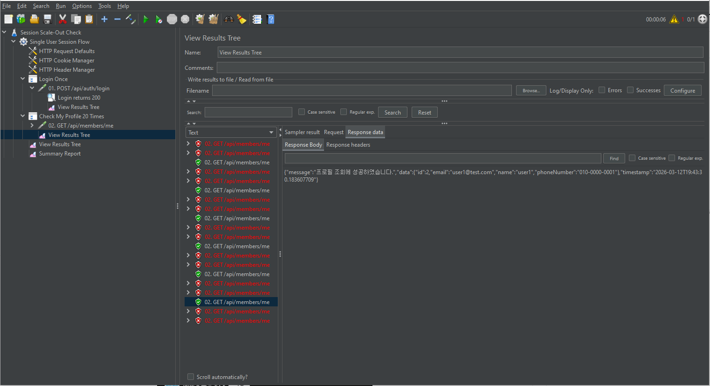

원인은 로그인 세션이 특정 서버 메모리에만 저장되기 때문이었습니다. 로드밸런서가 다음 요청을 다른 서버로 보내면, 해당 서버는 같은 `JSESSIONID`를 받아도 세션을 찾지 못했습니다.

#### 1차 완화: Sticky Session

Target Group에서 Sticky Session을 활성화해 같은 사용자의 요청이 같은 서버로 고정되도록 설정했습니다.

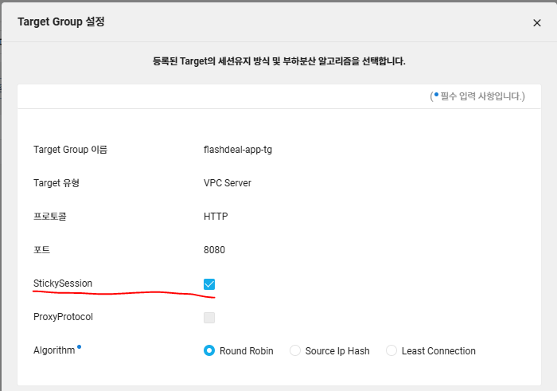

같은 시나리오를 다시 실행하자 `/api/members/me` 20회가 모두 성공했습니다.

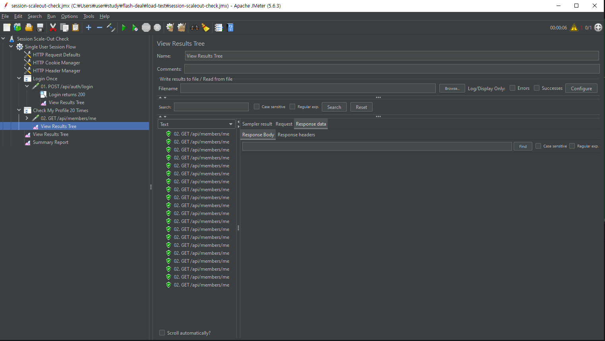

| 구분 | 결과 |
|------|------|
| 적용 전 | `6 성공 / 14 실패` |
| 적용 후 | `20 성공 / 0 실패` |

하지만 Sticky Session은 세션을 공유한 것이 아니라, 같은 사용자를 같은 서버로 계속 보내는 방식이었습니다. 서버 장애 시 세션이 함께 사라지고, 특정 서버 쏠림도 발생할 수 있어 최종안으로는 적절하지 않았습니다.

#### 최종 해결: Spring Session + Redis

최종적으로는 세션 저장소를 애플리케이션 서버 메모리 밖으로 분리했습니다.

- `Spring Session + Redis` 적용
- 세션 저장 위치를 서버 메모리에서 Redis로 이전
- 어느 서버가 요청을 받아도 같은 `JSESSIONID`로 Redis에서 세션 조회 가능

실제로 Redis에도 아래와 같은 세션 키가 저장되는 것을 확인했습니다.

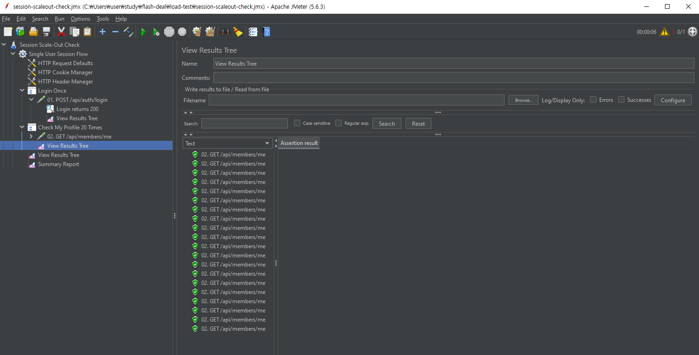

- `flashdeal:session:sessions:<sessionId>`
- `flashdeal:session:sessions:expires:<sessionId>`
- `flashdeal:session:expirations:<timestamp>`
- `flashdeal:session:index:org.springframework.session.FindByIndexNameSessionRepository.PRINCIPAL_NAME_INDEX_NAME:<email>`

이를 통해 V2에서는 Sticky Session 없이도, 어느 서버가 요청을 받더라도 동일한 로그인 상태를 유지할 수 있는 구조를 적용했습니다.

</details>

<details>
<summary><strong>V2 - "왜 어떤 서버는 새 딜이 보이고, 어떤 서버는 안 보일까?" 로컬 캐시 불일치 해결</strong></summary>

#### 문제 상황

Scale-Out 환경에서 각 앱 서버가 로컬 Caffeine 캐시를 사용하자, 서버마다 서로 다른 캐시 데이터를 보유하게 되었습니다.

실제로 서버 3대에서 모두 딜 목록 캐시를 적재한 뒤, 한 서버에서 새로운 딜을 생성하고 다시 조회해보니:

- 어떤 서버는 최신 딜이 포함된 응답을 반환했고
- 어떤 서버는 이전에 저장된 오래된 캐시 데이터를 그대로 반환했습니다

즉, 같은 시점에도 서버마다 다른 응답을 반환하는 **캐시 불일치 문제**가 발생했습니다.

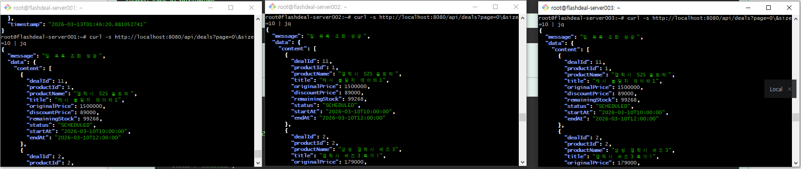

> 서버 3대에서 동일한 딜 목록 캐시를 먼저 적재

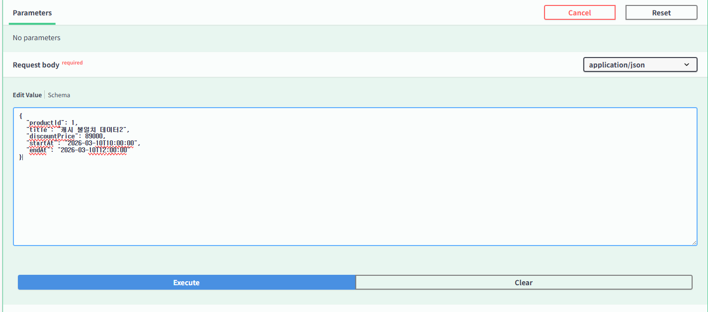

> 한 서버에서 새로운 딜 생성

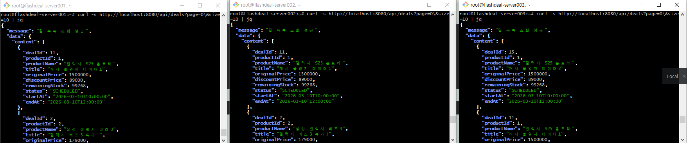

> 같은 시점에도 서버마다 서로 다른 딜 목록을 반환

#### 원인

기존 캐시는 각 서버 JVM 메모리에 저장되는 **로컬 캐시(Caffeine)** 였습니다.

따라서:
- `app-server-1` 에서 캐시를 비워도
- `app-server-2`, `app-server-3` 의 캐시는 그대로 남아 있었고
- 로드밸런서를 통해 들어오는 요청은 서버마다 다른 결과를 반환할 수 있었습니다.

#### 캐시 전략을 결정하며 고민한 점

처음에는 딜 메타데이터가 자주 변경되지 않는다는 점에서,  
`로컬 캐시 + 짧은 TTL` 만으로도 충분하지 않을까 고민했습니다.

실제로 딜은 관리자가 미리 등록해두고, 사용자는 정해진 시간에 접속해 조회하고 구매하는 흐름에 가깝습니다.  
즉 재고처럼 초 단위로 계속 바뀌는 데이터가 아니기 때문에, 메타데이터만 놓고 보면 로컬 캐시도 충분히 현실적인 선택이었습니다.

하지만 V2는 단순히 조회 성능을 높이는 것이 아니라,  
**Scale-Out 환경에서 서버 간 동일한 데이터를 안정적으로 제공할 수 있는 구조를 만드는 것**이 더 중요했습니다.

로컬 캐시는 불일치를 줄일 수는 있지만, 서버마다 캐시가 분리되어 있기 때문에  
구조적으로 같은 시점의 일관성을 보장하지는 못한다고 판단했습니다.

#### 최종 선택: Redis 공용 캐시

Redis 공용 캐시는:

- 여러 앱 서버가 동일한 캐시 데이터를 바라볼 수 있고
- Scale-Out 환경에서도 캐시 일관성을 유지할 수 있으며
- 이후 세션 저장소, 조회 캐시 등 공통 인프라 계층으로 확장하기에도 적합했습니다.

그래서 최종적으로는:

- **딜 메타데이터는 Redis 공용 캐시**
- **재고는 DB 실시간 조회**
- **주문 시점은 항상 DB 기준 재검증**

구조를 선택했습니다.

#### 딜 상세 조회는 어떻게 분리했는가

한정판매 이커머스에서는 모든 데이터를 캐시하면 안 된다고 판단했습니다.

- 캐시 가능한 데이터
  - 딜 제목, 설명, 이미지, 할인 가격, 시작/종료 시간 같은 메타데이터
- 캐시하면 안 되는 데이터
  - 재고 수량
  - 품절 여부
  - 실제 주문 가능 여부

특히 재고는 조금만 오래된 값이 보여도 오버셀링으로 이어질 수 있기 때문에,  
**정합성이 성능보다 우선**이라고 판단했습니다.

그래서 딜 상세 조회는 아래 두 영역으로 분리했습니다.

- **캐시 가능 영역**
  - 딜/상품 메타데이터
- **실시간 조회 영역**
  - 현재 재고 정보

조회 흐름은 다음과 같습니다.

1. Redis에서 딜 메타데이터 조회
2. DB에서 현재 재고 조회
3. 두 데이터를 조합해 최종 응답 생성

```text
GET /api/deals/{dealId}
 -> Redis: 딜 메타데이터 조회
 -> DB: 현재 재고 조회
 -> DealResponse 조합
```

즉, "보여주는 정보"와 "판단 기준 정보"를 분리했습니다.

#### 코드 구조

책임을 분리하기 위해 캐시 조회 서비스와 오케스트레이션 로직을 나눴습니다.

- `DealCacheService`
  - `@Cacheable` 로 딜 메타데이터 캐시 조회
- `StockService`
  - 현재 재고 실시간 조회
- `DealService`
  - 메타데이터 + 재고를 조합해 최종 `DealResponse` 반환

```java
@Cacheable(value = "deal", key = "#dealId")
public DealDetailCacheValue getDealDetailMetadata(Long dealId) {
    return dealRepository.findDealDetailCacheValueById(dealId)
        .orElseThrow(() -> new CustomException(DealErrorCode.DEAL_NOT_FOUND));
}
```

> `DealCacheService`는 캐시 가능한 딜 메타데이터만 Redis에서 조회합니다.

```java
public DealResponse getDeal(Long dealId) {
    DealDetailCacheValue metadata = dealCacheService.getDealDetailMetadata(dealId);
    Stock stock = stockService.getStock(metadata.productId());

    return metadata.toResponse(stock.getQuantity());
}
```

> `DealService`는 Redis에서 가져온 메타데이터와 DB에서 조회한 재고를 조합해 최종 응답을 생성합니다.

#### 캐시 읽기/쓰기 전략을 결정하며 고민한 점

딜 조회 캐시를 설계하면서, 읽기 전략은 `Cache-Aside`, 쓰기 전략은 `Write-Invalidate`를 선택했습니다.

먼저 읽기 전략에서는 `Read-Through`도 고려할 수 있었지만,  
이 프로젝트는 모든 데이터를 캐시하지 않고 **딜 메타데이터만 캐시하고 재고는 실시간 조회**해야 했습니다.  
즉 캐시 대상과 비캐시 대상을 애플리케이션에서 세밀하게 분리해야 했기 때문에,  
캐시 조회와 DB 조회 흐름을 직접 제어할 수 있는 `Cache-Aside`가 더 적합하다고 판단했습니다.

쓰기 전략에서는 `Write-Through`도 검토했지만,  
딜 생성/변경 시점마다 상세 캐시와 페이지 단위 목록 캐시를 모두 즉시 갱신하는 것은 구현 복잡도가 높았습니다.  
특히 목록 캐시는 페이지, 크기, 향후 정렬/필터 조건에 따라 여러 캐시 키가 생길 수 있어,  
쓰기 시점에 정확한 값을 모두 갱신하는 것보다 **DB를 먼저 반영한 뒤 관련 캐시를 비우고, 다음 조회 요청에서 최신 데이터를 다시 적재하는 `Write-Invalidate` 방식이 더 단순하고 안전**하다고 판단했습니다.

결과적으로 이 프로젝트의 캐시 전략은 다음과 같이 정리했습니다.

- 읽기: `Cache-Aside`
- 쓰기: `Write-Invalidate`
- 재고: 캐시하지 않고 DB 실시간 조회
- 주문 시점: 항상 DB 기준 재검증

즉 성능만 극대화하는 전략보다,  
**한정판매 이커머스에서 중요한 정합성과 Scale-Out 환경의 일관성을 함께 고려한 전략**을 선택했습니다.

#### 딜 목록 캐시 전략을 결정하며 고민한 점

처음에는 한정판매 딜의 특성상, 사용자에게 동시에 노출되는 딜 수가 많지 않을 것이라고 판단했습니다.  
그래서 처음에는 **첫 페이지 캐시** 또는 **페이지네이션 제거**까지도 검토했습니다.

하지만 이 방향을 그대로 선택하기에는 한 가지 문제가 있었습니다.

한정판매 딜은 평소에는 적은 수로 운영될 수 있지만,  
이벤트나 운영 정책에 따라 어느 날은 10개 이상이 동시에 노출될 가능성도 충분히 있었습니다.  
즉 "지금은 적다"는 이유만으로 구조 자체를 단순화하면, 이후 딜 수가 늘어났을 때 다시 API와 캐시 전략을 변경해야 할 수 있다고 판단했습니다.

그래서 다음과 같이 판단했습니다.

- 딜 수가 적다고 해서 페이지네이션을 제거하지는 않는다
- 향후 노출 딜 수 증가 가능성을 고려해 페이지네이션은 유지한다
- 다만 캐시는 **페이지 단위**로 적용해 목록 조회 성능을 개선한다

#### 결과

최종적으로 V2의 캐시 전략은 다음과 같이 정리했습니다.

- **딜 상세 조회**
  - 메타데이터는 Redis 캐시
  - 재고는 실시간 조회
- **딜 목록 조회**
  - 페이지네이션은 유지
  - 목록은 페이지 단위 Redis 캐시
  - 재고는 캐시 판단 기준에서 제외
- **주문 시점**
  - 항상 DB 기준 재검증

이를 통해:

- Redis 공용 캐시로 서버 간 메타데이터 일관성 확보
- 로컬 캐시 불일치 문제 제거
- 재고는 실시간 조회로 정합성 유지
- Scale-Out 환경에서 성능과 정합성을 함께 고려한 캐시 구조 확보

</details>
